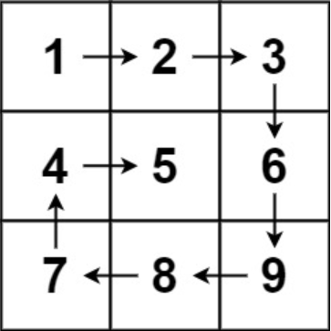
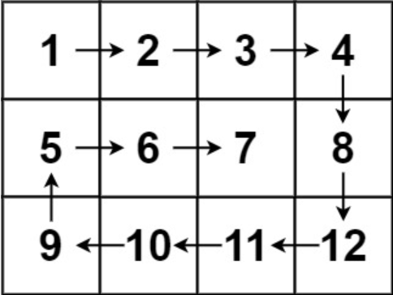

题目链接：[54-螺旋矩阵](https://leetcode-cn.com/problems/spiral-matrix/)

难度：<font color="Orange">中等</font>

题目内容：

给你一个 m 行 n 列的矩阵 matrix ，请按照 顺时针螺旋顺序 ，返回矩阵中的所有元素。

示例 1：<br>
<br>
输入：matrix = [[1,2,3],[4,5,6],[7,8,9]]<br>
输出：[1,2,3,6,9,8,7,4,5]

示例 2：<br>
<br>
输入：matrix = [[1,2,3,4],[5,6,7,8],[9,10,11,12]]<br>
输出：[1,2,3,4,8,12,11,10,9,5,6,7]

提示：<br>
m == matrix.length<br>
n == matrix[i].length<br>
1 <= m, n <= 10<br>
-100 <= matrix[i][j] <= 100

注：
以下问题与本题相同：[剑指 Offer 29-顺时针打印矩阵](https://leetcode-cn.com/problems/shun-shi-zhen-da-yin-ju-zhen-lcof/)


代码：
```
const int RIGHT = 1;
const int DOWN = 2;
const int LEFT = 3;
const int UP = 4;

class Solution {
public:
    vector<int> spiralOrder(vector<vector<int>>& matrix) {
        int m = matrix.size();
        int n = matrix[0].size();
        vector<int> ans(m * n);
        vector<vector<bool>> check(m, vector<bool>(n, false));
        int x = 0;
        int y = 0;
        int dir = RIGHT;
        for (int pos = 0; pos < m * n; ++pos) {
            ans[pos] = matrix[x][y];
            check[x][y] = true;
            switch (dir) {
                case RIGHT: {
                    if (y == n - 1 || check[x][y + 1]) {
                        ++x;
                        dir = DOWN;
                    }
                    else
                        ++y;
                    break;
                }
                case DOWN: {
                    if (x == m - 1 || check[x + 1][y]) {
                        --y;
                        dir = LEFT;
                    }
                    else
                        ++x;
                    break;
                }
                case LEFT: {
                    if (y == 0 || check[x][y - 1]) {
                        --x;
                        dir = UP;
                    }
                    else
                        --y;
                    break;
                }
                case UP: {
                    if (x == 0 || check[x - 1][y]) {
                        ++y;
                        dir = RIGHT;
                    }
                    else
                        --x;
                    break;
                }
                default: break;
            }
        }
        return ans;
    }
};
```