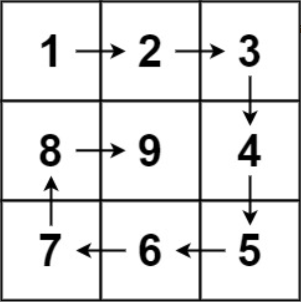

题目链接：[59-螺旋矩阵II](https://leetcode-cn.com/problems/spiral-matrix-ii/)

难度：<font color="Orange">中等</font>

题目内容：

给你一个正整数 n ，生成一个包含 1 到 n2 所有元素，且元素按顺时针顺序螺旋排列的 n x n 正方形矩阵 matrix 。

示例 1：<br>
<br>
输入：n = 3<br>
输出：\[[1,2,3],[8,9,4],[7,6,5]]

示例 2：<br>
输入：n = 1<br>
输出：\[[1]]

提示：<br>
1 <= n <= 20


代码：
```
const int RIGHT = 1;
const int DOWN = 2;
const int LEFT = 3;
const int UP = 4;

class Solution {
public:
    vector<vector<int>> generateMatrix(int n) {
        vector<vector<int>> ans(n, vector<int>(n, 0));
        int x = 0;
        int y = 0;
        int dir = RIGHT;
        for (int temp = 1; temp <= n * n; ++temp) {
            ans[x][y] = temp;
            switch (dir) {
                case RIGHT: {
                    if (y == n - 1 || ans[x][y + 1]) {
                        ++x;
                        dir = DOWN;
                    }
                    else
                        ++y;
                    break;
                }
                case DOWN: {
                    if (x == n - 1 || ans[x + 1][y]) {
                        --y;
                        dir = LEFT;
                    }
                    else
                        ++x;
                    break;
                }
                case LEFT: {
                    if (y == 0 || ans[x][y - 1]) {
                        --x;
                        dir = UP;
                    }
                    else
                        --y;
                    break;
                }
                case UP: {
                    if (x == 0 || ans[x - 1][y]) {
                        ++y;
                        dir = RIGHT;
                    }
                    else
                        --x;
                    break;
                }
                default: break;
            }
        }
        return ans;
    }
};
```