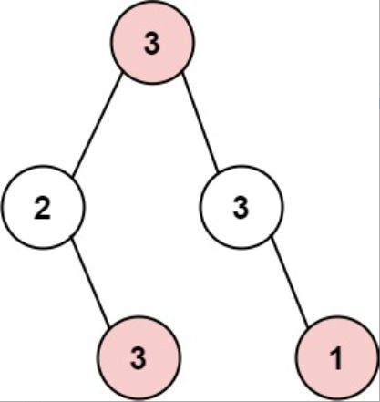
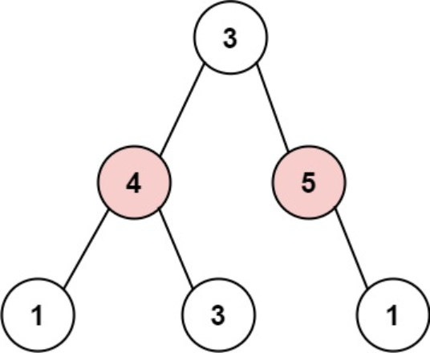

题目链接：[337-打家劫舍III](https://leetcode-cn.com/problems/house-robber-iii/)

难度：<font color="Orange">中等</font>

题目内容：

小偷又发现了一个新的可行窃的地区。这个地区只有一个入口，我们称之为 root 。<br>
除了 root 之外，每栋房子有且只有一个“父”房子与之相连。一番侦察之后，聪明的小偷意识到“这个地方的所有房屋的排列类似于一棵二叉树”。 如果 两个直接相连的房子在同一天晚上被打劫 ，房屋将自动报警。<br>
给定二叉树的 root 。返回 在不触动警报的情况下 ，小偷能够盗取的最高金额 。

示例 1:<br>
<br>
输入: root = [3,2,3,null,3,null,1]<br>
输出: 7 <br>
解释: 小偷一晚能够盗取的最高金额 3 + 3 + 1 = 7

示例 2:<br>
<br>
输入: root = [3,4,5,1,3,null,1]<br>
输出: 9<br>
解释: 小偷一晚能够盗取的最高金额 4 + 5 = 9

提示：<br>
树的节点数在 [1, 10^4] 范围内<br>
0 <= Node.val <= 10^4


代码：
```
/**
 * Definition for a binary tree node.
 * struct TreeNode {
 *     int val;
 *     TreeNode *left;
 *     TreeNode *right;
 *     TreeNode() : val(0), left(nullptr), right(nullptr) {}
 *     TreeNode(int x) : val(x), left(nullptr), right(nullptr) {}
 *     TreeNode(int x, TreeNode *left, TreeNode *right) : val(x), left(left), right(right) {}
 * };
 */

// 树形DP
// 对于每个节点，维护一个长度为2的向量，分别存储偷这个节点和不偷这个节点对应的最大金额
class Solution {
public:
    vector<int> dp(TreeNode* root) {
        if (!root)
            return {0, 0};
        auto left = dp(root->left);
        auto right = dp(root->right);
        int val1 = max(left[0], left[1]) + max(right[0], right[1]);
        int val2 = left[0] + right[0] + root->val;
        return {val1, val2};
    }

    int rob(TreeNode* root) {
        auto temp = dp(root);
        return max(temp[0], temp[1]);
    }
};
```