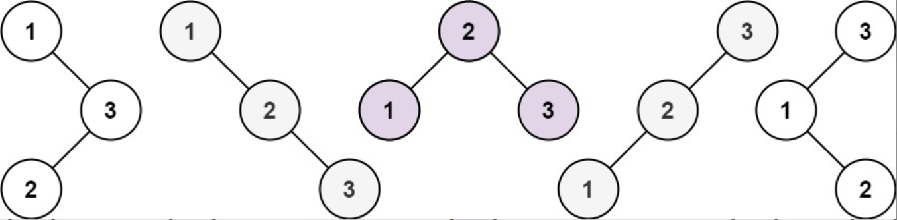

题目链接：[96-不同的二叉搜索树](https://leetcode-cn.com/problems/integer-break/)

难度：<font color="Orange">中等</font>

题目内容：

给你一个整数 n ，求恰由 n 个节点组成且节点值从 1 到 n 互不相同的 二叉搜索树 有多少种？返回满足题意的二叉搜索树的种数。

示例 1：<br>
<br>
输入：n = 3<br>
输出：5

示例 2：<br>
输入：n = 1<br>
输出：1

提示：<br>
1 <= n <= 19


代码：
```
// dp[i]表示1-i所能表示的二叉搜索树数量
// 对于1-i中每个数j，如果将j作为根，左子树数量为dp[j - 1]， 右子树数量为dp[i - j]
// 因此可得，dp[i] = sum(dp[j - 1] * dp[i - j]);
class Solution {
public:
    int numTrees(int n) {
        vector<int> dp(n + 1);
        dp[0] = 1;
        dp[1] = 1;
        for (int i = 2; i <= n; ++i) {
            for (int j = 1; j <= i; ++j)
                dp[i] += dp[j - 1] * dp[i - j];
        }
        return dp.back();
    }
};
```