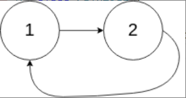

题目链接：[142-环形链表II](https://leetcode-cn.com/problems/linked-list-cycle-ii/)

难度：<font color="Orange">中等</font>

题目内容：

给定一个链表的头节点  head ，返回链表开始入环的第一个节点。 如果链表无环，则返回 null。<br>
如果链表中有某个节点，可以通过连续跟踪 next 指针再次到达，则链表中存在环。 为了表示给定链表中的环，评测系统内部使用整数 pos 来表示链表尾连接到链表中的位置（索引从 0 开始）。如果 pos 是 -1，则在该链表中没有环。注意：pos 不作为参数进行传递，仅仅是为了标识链表的实际情况。<br>
不允许修改 链表。

示例 1：<br>
<br>
输入：head = [3,2,0,-4], pos = 1<br>
输出：返回索引为 1 的链表节点<br>
解释：链表中有一个环，其尾部连接到第二个节点。

示例 2：<br>
<br>
输入：head = [1,2], pos = 0<br>
输出：返回索引为 0 的链表节点<br>
解释：链表中有一个环，其尾部连接到第一个节点。

示例 3：<br>
<br>
输入：head = [1], pos = -1<br>
输出：返回 null<br>
解释：链表中没有环。

提示：<br>
链表中节点的数目范围在范围 [0, 10^4] 内<br>
-10^5 <= Node.val <= 10^5<br>
pos 的值为 -1 或者链表中的一个有效索引

进阶：你是否可以使用 O(1) 空间解决此题？


代码：
```
/**
 * Definition for singly-linked list.
 * struct ListNode {
 *     int val;
 *     ListNode *next;
 *     ListNode(int x) : val(x), next(NULL) {}
 * };
 */
class Solution {
public:
    ListNode *detectCycle(ListNode *head) {
        if (!head)
            return nullptr;
        ListNode* fast = head;
        ListNode* slow = head;
        ListNode* p = nullptr;
        ListNode* q = nullptr;
        while (fast->next && fast->next->next) {
            fast = fast->next->next;
            slow = slow->next;
            if (fast == slow) {
                q = fast;
                break;
            }
        }
        if (!q)
            return nullptr;
        p = head;
        while (p != q) {
            p = p->next;
            q = q->next;
        }
        return p;
    }
};
```