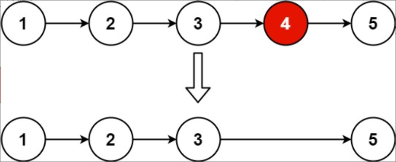

题目链接：[19-删除链表的倒数第N个结点](https://leetcode-cn.com/problems/remove-nth-node-from-end-of-list/)

难度：<font color="Orange">中等</font>

题目内容：

给你一个链表，删除链表的倒数第 n 个结点，并且返回链表的头结点。

示例 1：<br>
<br>
输入：head = [1,2,3,4,5], n = 2<br>
输出：[1,2,3,5]

示例 2：<br>
输入：head = [1], n = 1<br>
输出：[]

示例 3：<br>
输入：head = [1,2], n = 1<br>
输出：[1]

提示：<br>
链表中结点的数目为 sz<br>
1 <= sz <= 30<br>
0 <= Node.val <= 100<br>
1 <= n <= sz

进阶：你能尝试使用一趟扫描实现吗？


代码：
```
/**
 * Definition for singly-linked list.
 * struct ListNode {
 *     int val;
 *     ListNode *next;
 *     ListNode() : val(0), next(nullptr) {}
 *     ListNode(int x) : val(x), next(nullptr) {}
 *     ListNode(int x, ListNode *next) : val(x), next(next) {}
 * };
 */
class Solution {
public:
    ListNode* removeNthFromEnd(ListNode* head, int n) {
        ListNode* q = head;
        while (n--)
            q = q->next;
        ListNode* new_head = new ListNode(0);
        new_head->next = head;
        ListNode* p = new_head;
        while (q) {
            p = p->next;
            q = q->next;
        }
        ListNode* temp = p->next;
        p->next = temp->next;
        delete temp;
        head = new_head->next;
        delete new_head;
        return head;
    }
};
```