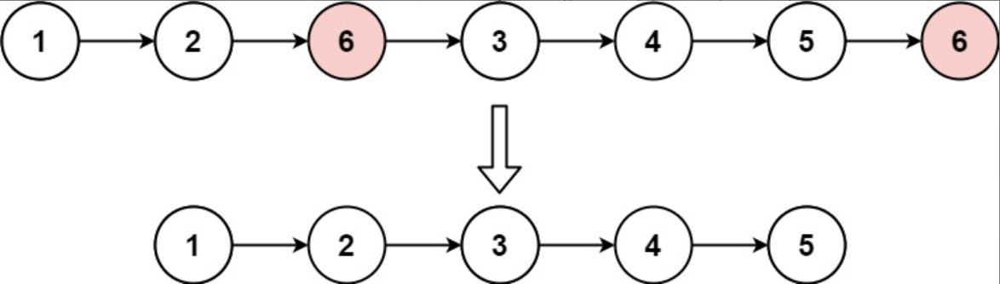

题目链接：[203-移除链表元素](https://leetcode-cn.com/problems/remove-linked-list-elements/)

难度：<font color="Green">简单</font>

题目内容：

给你一个链表的头节点 head 和一个整数 val ，请你删除链表中所有满足 Node.val == val 的节点，并返回 新的头节点 。

示例 1：<br>
<br>
输入：head = [1,2,6,3,4,5,6], val = 6<br>
输出：[1,2,3,4,5]

示例 2：<br>
输入：head = [], val = 1<br>
输出：[]

示例 3：<br>
输入：head = [7,7,7,7], val = 7<br>
输出：[]

提示：<br>
列表中的节点数目在范围 [0, 10^4] 内<br>
1 <= Node.val <= 50<br>
0 <= val <= 50


代码：
```
/**
 * Definition for singly-linked list.
 * struct ListNode {
 *     int val;
 *     ListNode *next;
 *     ListNode() : val(0), next(nullptr) {}
 *     ListNode(int x) : val(x), next(nullptr) {}
 *     ListNode(int x, ListNode *next) : val(x), next(next) {}
 * };
 */

// 直接删除的话由于头节点没有前一个节点，需要单独处理
class Solution {
public:
    ListNode* removeElements(ListNode* head, int val) {
        if (!head)
            return nullptr;
        while (head && head->val == val) {
            ListNode* temp = head;
            head = head->next;
            delete temp;
        }
        ListNode* p = head;
        while (p && p->next) {
            if (p->next->val == val) {
                ListNode* temp = p->next;
                p->next = p->next->next;
                delete temp;
            }
            else
                p = p->next;
        }
        return head;
    }
};

// 设置一个虚拟头节点，这样链表所有节点就可以用同种方式删除
class Solution {
public:
    ListNode* removeElements(ListNode* head, int val) {
        ListNode* new_head = new ListNode(0);
        new_head->next = head;
        ListNode* p = new_head;
        while (p && p->next) {
            if (p->next->val == val) {
                ListNode* temp = p->next;
                p->next = p->next->next;
                delete temp;
            }
            else
                p = p->next;
        }
        head = new_head->next;
        delete new_head;
        return head;
    }
};
```