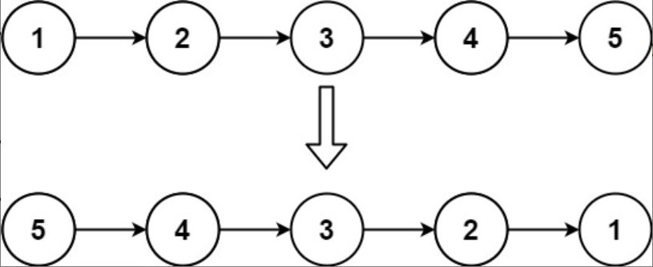
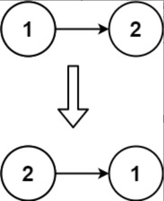

题目链接：[206-反转链表](https://leetcode-cn.com/problems/reverse-linked-list/)

难度：<font color="Green">简单</font>

题目内容：

给你单链表的头节点 head ，请你反转链表，并返回反转后的链表。

示例 1：<br>
<br>
输入：head = [1,2,3,4,5]<br>
输出：[5,4,3,2,1]

示例 2：<br>
<br>
输入：head = [1,2]<br>
输出：[2,1]

示例 3：<br>
输入：head = []<br>
输出：[]

提示：<br>
链表中节点的数目范围是 [0, 5000]<br>
-5000 <= Node.val <= 5000

进阶：链表可以选用迭代或递归方式完成反转。你能否用两种方法解决这道题？


代码：
```
/**
 * Definition for singly-linked list.
 * struct ListNode {
 *     int val;
 *     ListNode *next;
 *     ListNode() : val(0), next(nullptr) {}
 *     ListNode(int x) : val(x), next(nullptr) {}
 *     ListNode(int x, ListNode *next) : val(x), next(next) {}
 * };
 */

// 迭代，利用双指针法
class Solution {
public:
    ListNode* reverseList(ListNode* head) {
        if (head && head->next) {
            ListNode* pre = nullptr;
            while (head->next) {
                ListNode* p = head->next;
                head->next = pre;
                pre = head;
                head = p;
            }
            head->next = pre;
        }
        return head;
    }
};

// 递归，每次反转从第二个节点开始的链表，之后调整头节点与所得链表的顺序关系
class Solution {
public:
    ListNode* reverseList(ListNode* head) {
        if (head && head->next) {
            ListNode* last = reverseList(head->next);
            head->next->next = head;
            head->next = nullptr;
            return last;
        }
        return head;
    }
};
```