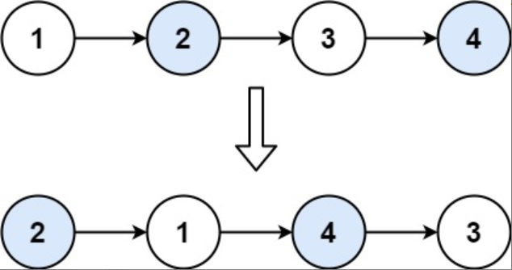

题目链接：[24-两两交换链表中的节点](https://leetcode-cn.com/problems/swap-nodes-in-pairs/)

难度：<font color="Orange">中等</font>

题目内容：

给你一个链表，两两交换其中相邻的节点，并返回交换后链表的头节点。你必须在不修改节点内部的值的情况下完成本题（即，只能进行节点交换）。

示例 1：<br>
<br>
输入：head = [1,2,3,4]<br>
输出：[2,1,4,3]

示例 2：<br>
输入：head = []<br>
输出：[]

示例 3：<br>
输入：head = [1]<br>
输出：[1]


提示：<br>
链表中节点的数目在范围 [0, 100] 内<br>
0 <= Node.val <= 100


代码：
```
/**
 * Definition for singly-linked list.
 * struct ListNode {
 *     int val;
 *     ListNode *next;
 *     ListNode() : val(0), next(nullptr) {}
 *     ListNode(int x) : val(x), next(nullptr) {}
 *     ListNode(int x, ListNode *next) : val(x), next(next) {}
 * };
 */
class Solution {
public:
    ListNode* swapPairs(ListNode* head) {
        ListNode* new_head = new ListNode(0);
        new_head->next = head;
        ListNode* p = new_head;
        while (p->next && p->next->next) {
            ListNode* q = p->next;
            ListNode* r = q->next;
            ListNode* s = r->next;
            p->next = r;
            r->next = q;
            q->next = s;
            p = q;
        }
        head = new_head->next;
        delete new_head;
        return head;
    }
};
```