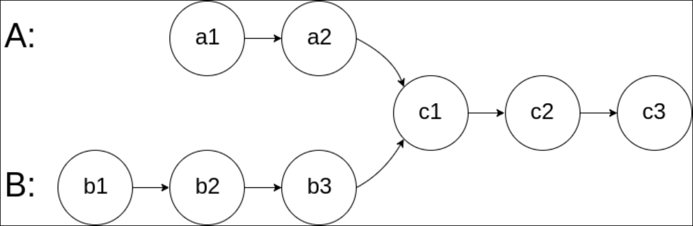
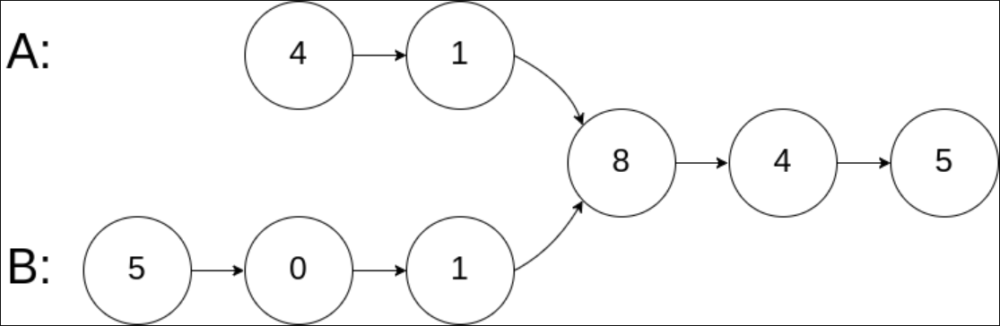
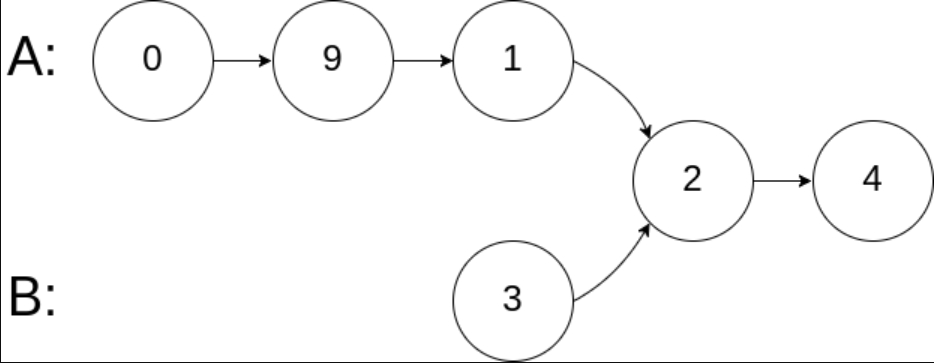
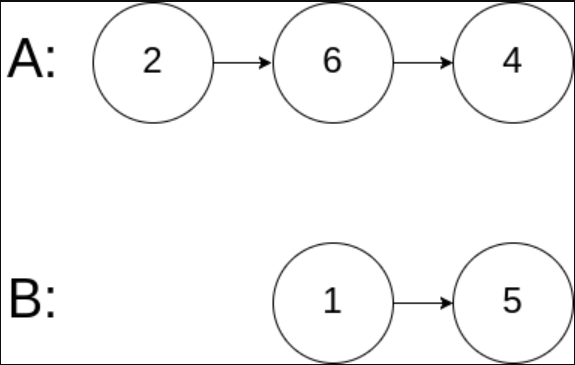

题目链接：[面试题 02.07-链表相交](https://leetcode-cn.com/problems/intersection-of-two-linked-lists-lcci/)

难度：<font color="Green">简单</font>

题目内容：

给你两个单链表的头节点 headA 和 headB ，请你找出并返回两个单链表相交的起始节点。如果两个链表没有交点，返回 null 。<br>
图示两个链表在节点 c1 开始相交：<br>
<br>
题目数据 保证 整个链式结构中不存在环。<br>
注意，函数返回结果后，链表必须 保持其原始结构 。

示例 1：<br>
<br>
输入：intersectVal = 8, listA = [4,1,8,4,5], listB = [5,0,1,8,4,5], skipA = 2, skipB = 3<br>
输出：Intersected at '8'<br>
解释：相交节点的值为 8 （注意，如果两个链表相交则不能为 0）。<br>
从各自的表头开始算起，链表 A 为 [4,1,8,4,5]，链表 B 为 [5,0,1,8,4,5]。<br>
在 A 中，相交节点前有 2 个节点；在 B 中，相交节点前有 3 个节点。

示例 2：<br>
<br>
输入：intersectVal = 2, listA = [0,9,1,2,4], listB = [3,2,4], skipA = 3, skipB = 1<br>
输出：Intersected at '2'<br>
解释：相交节点的值为 2 （注意，如果两个链表相交则不能为 0）。<br>
从各自的表头开始算起，链表 A 为 [0,9,1,2,4]，链表 B 为 [3,2,4]。<br>
在 A 中，相交节点前有 3 个节点；在 B 中，相交节点前有 1 个节点。

示例 3：<br>
<br>
输入：intersectVal = 0, listA = [2,6,4], listB = [1,5], skipA = 3, skipB = 2<br>
输出：null<br>
解释：从各自的表头开始算起，链表 A 为 [2,6,4]，链表 B 为 [1,5]。<br>
由于这两个链表不相交，所以 intersectVal 必须为 0，而 skipA 和 skipB 可以是任意值。<br>
这两个链表不相交，因此返回 null 。

提示：<br>
listA 中节点数目为 m<br>
listB 中节点数目为 n<br>
0 <= m, n <= 3 * 10^4<br>
1 <= Node.val <= 10^5<br>
0 <= skipA <= m<br>
0 <= skipB <= n<br>
如果 listA 和 listB 没有交点，intersectVal 为 0<br>
如果 listA 和 listB 有交点，intersectVal == listA[skipA + 1] == listB[skipB + 1]

进阶：你能否设计一个时间复杂度 O(n) 、仅用 O(1) 内存的解决方案？


代码：
```
/**
 * Definition for singly-linked list.
 * struct ListNode {
 *     int val;
 *     ListNode *next;
 *     ListNode(int x) : val(x), next(NULL) {}
 * };
 */
class Solution {
public:
    ListNode *getIntersectionNode(ListNode *headA, ListNode *headB) {
        int lenA = 0;
        int lenB = 0;
        ListNode* p = headA;
        ListNode* q = headB;
        while (p) {
            p = p->next;
            ++lenA;
        }
        while (q) {
            q = q->next;
            ++lenB;
        }
        int diff = abs(lenA - lenB);
        p = headA;
        q = headB;
        if (lenA > lenB) {
            while (diff--)
                p = p->next;
        }
        else {
            while (diff--)
                q = q->next;
        }
        while (p) {
            if (p == q)
                return p;
            p = p->next;
            q = q->next;
        }
        return nullptr;
    }
};
```