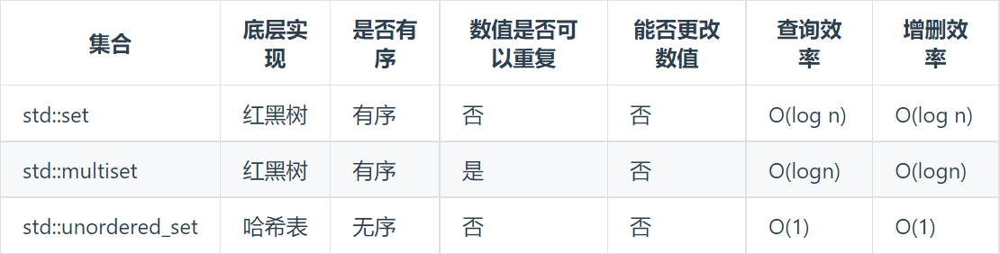
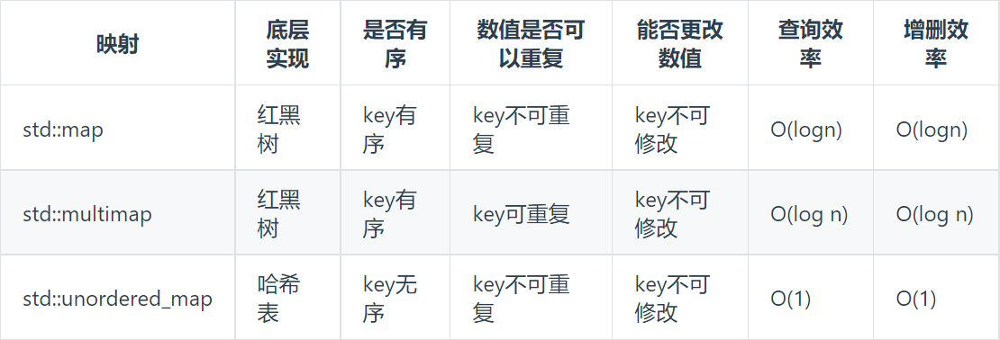

# 哈希表理论基础

## 哈希表定义与特征
- 哈希表是一种根据关键码的值而直接进行访问的数据结构，一般用来快速判断一个元素是否出现集合里
- 当我们想使用哈希法来解决问题的时候，我们一般会选择如下三种数据结构：
  - 数组
  - set：C++中提供相关结构及其特点如下
   
  - map：C++中提供相关结构及其特点如下
   
- 由以上表格可知，当采用哈希表时，需要根据具体情况决定采用哪种结构作为哈希表：
  - 数组：当哈希key值范围有限时，由于数组没有底层数据结构需要维护，因此效率更高，通常考虑使用数组作为哈希表
  - set：当哈希key值范围很大时，由于：
    - 数组大小有限，受系统栈空间限制
    - 如果数组空间够大，但哈希值较少、特别分散、跨度很大，使用数组就造成空间的极大浪费 
    因此，如果只需要存储key，可以考虑使用set作为哈希表
    - 注意：如果题目不要求排序，由于unordered_set底层由哈希表实现，查询和增删的时间复杂度为O(1)，效率极佳，因此优先考虑unordered_set；如果要求顺序，再考虑set与multiset
  - map：set是一个集合，里面放的元素只能是一个key。如果想存储有映射关系的两个值，需要采用map作为哈希表
    - 注意：如果题目不要求排序，由于unordered_map底层由哈希表实现，查询和增删的时间复杂度为O(1)，效率极佳，因此优先考虑unordered_map；如果要求顺序，再考虑map与multimap
    - 一般来说，map在哈希问题中是万能的，但有些特定情况下map的效率较低，因此会考虑使用数组或set

## 经典题目与技巧

- 三种用于哈希表的数据结构的使用条件上面已经提到，可以通过以下题目来进一步理解

### 数组作为哈希表
- 对应例题：
  - [242-有效的字母异位词](例题/242-有效的字母异位词.md)
  - [383-赎金信](例题/383-赎金信.md)
  - [49-字母异位词分组](例题/49-字母异位词分组.md)
  - [438-找到字符串中所有字母异位词](例题/438-找到字符串中所有字母异位词.md)

### set作为哈希表
- 对应例题：
  - [349-两个数组的交集](例题/349-两个数组的交集.md)
  - [202-快乐数](例题/202-快乐数.md)

### map作为哈希表
- 对应例题：
  - [349-两个数组的交集II](例题/349-两个数组的交集II.md)
  - [1-两数之和](例题/1-两数之和.md)
  - [454-四数相加II](例题/454-四数相加II.md)