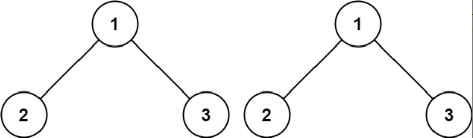
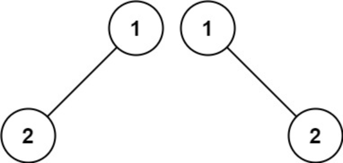
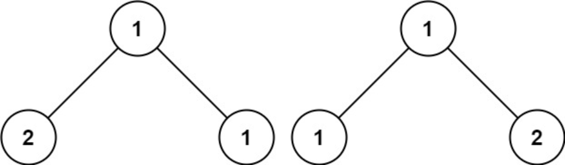

题目链接：[100-相同的树](https://leetcode-cn.com/problems/same-tree/)

难度：<font color="Green">简单</font>

题目内容：

给你两棵二叉树的根节点 p 和 q ，编写一个函数来检验这两棵树是否相同。<br>
如果两个树在结构上相同，并且节点具有相同的值，则认为它们是相同的。

示例 1：<br>
<br>
输入：p = [1,2,3], q = [1,2,3]<br>
输出：true

示例 2：<br>
<br>
输入：p = [1,2], q = [1,null,2]<br>
输出：false

示例 3：<br>
<br>
输入：p = [1,2,1], q = [1,1,2]<br>
输出：false

提示：<br>
两棵树上的节点数目都在范围 [0, 100] 内<br>
-10^4 <= Node.val <= 10^4


代码：
```
/**
 * Definition for a binary tree node.
 * struct TreeNode {
 *     int val;
 *     TreeNode *left;
 *     TreeNode *right;
 *     TreeNode() : val(0), left(nullptr), right(nullptr) {}
 *     TreeNode(int x) : val(x), left(nullptr), right(nullptr) {}
 *     TreeNode(int x, TreeNode *left, TreeNode *right) : val(x), left(left), right(right) {}
 * };
 */

// 递归
class Solution {
public:
    bool isSameTree(TreeNode* p, TreeNode* q) {
        if (!p && !q)
            return true;
        else if (!(p && q))
            return false;
        else if (p->val != q->val)
            return false;
        else
            return isSameTree(p->left, q->left) && isSameTree(p->right, q->right);
    }
};

// 迭代（利用队列）
class Solution {
public:
    bool isSameTree(TreeNode* p, TreeNode* q) {
        queue<TreeNode*> que;
        que.push(p);
        que.push(q);
        while (!que.empty()) {
            TreeNode* node_1 = que.front();
            que.pop();
            TreeNode* node_2 = que.front();
            que.pop();
            if (!node_1 && !node_2)
                continue;
            else if (!(node_1 && node_2))
                return false;
            else if (node_1->val != node_2->val)
                return false;
            else {
                que.push(node_1->left);
                que.push(node_2->left);
                que.push(node_1->right);
                que.push(node_2->right);
            }
        }
        return true;
    }
};

// 迭代（利用栈）
class Solution {
public:
    bool isSameTree(TreeNode* p, TreeNode* q) {
        stack<TreeNode*> s;
        s.push(p);
        s.push(q);
        while (!s.empty()) {
            TreeNode* node_1 = s.top();
            s.pop();
            TreeNode* node_2 = s.top();
            s.pop();
            if (!node_1 && !node_2)
                continue;
            else if (!(node_1 && node_2))
                return false;
            else if (node_1->val != node_2->val)
                return false;
            else {
                s.push(node_2->right);
                s.push(node_1->right);
                s.push(node_2->left);
                s.push(node_1->left);
            }
        }
        return true;
    }
};
```