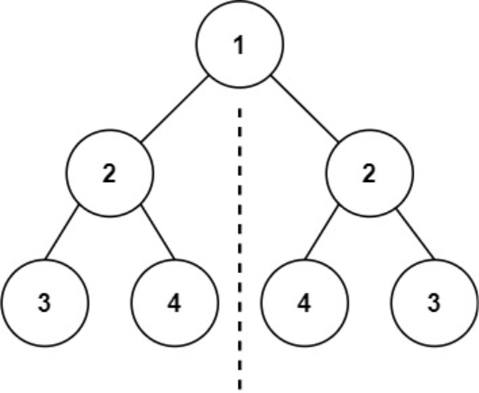
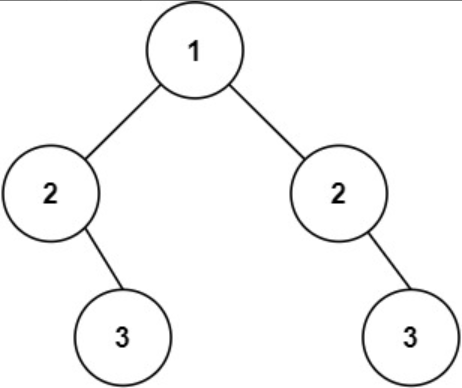

题目链接：[101-对称二叉树](https://leetcode-cn.com/problems/symmetric-tree/)

难度：<font color="Green">简单</font>

题目内容：

给你一个二叉树的根节点 root ， 检查它是否轴对称。

示例 1：<br>
<br>
输入：root = [1,2,2,3,4,4,3]<br>
输出：true

示例 2：<br>
<br>
输入：root = [1,2,2,null,3,null,3]<br>
输出：false

提示：<br>
树中节点数目在范围 [1, 1000] 内<br>
-100 <= Node.val <= 100

进阶：你可以运用递归和迭代两种方法解决这个问题吗？


代码：
```
/**
 * Definition for a binary tree node.
 * struct TreeNode {
 *     int val;
 *     TreeNode *left;
 *     TreeNode *right;
 *     TreeNode() : val(0), left(nullptr), right(nullptr) {}
 *     TreeNode(int x) : val(x), left(nullptr), right(nullptr) {}
 *     TreeNode(int x, TreeNode *left, TreeNode *right) : val(x), left(left), right(right) {}
 * };
 */

// 递归
class Solution {
public:
    bool cmp(TreeNode* left, TreeNode* right) {
        if (!left && !right)
            return true;
        else if (!(left && right))
            return false;
        else if (left->val != right->val)
            return false;
        else
            return cmp(left->left, right->right) && cmp(left->right, right->left);
    }

    bool isSymmetric(TreeNode* root) {
        if (!root)
            return true;
        return cmp(root->left, root->right); 
    }
};

// 迭代（利用队列）
class Solution {
public:
    bool isSymmetric(TreeNode* root) {
        queue<TreeNode*> q;
        if (root) {
            q.push(root->left);
            q.push(root->right);
            while (!q.empty()) {
                TreeNode* node_1 = q.front();
                q.pop();
                TreeNode* node_2 = q.front();
                q.pop();
                if (!node_1 && !node_2)
                    continue;
                else if (!(node_1 && node_2))
                    return false;
                else if (node_1->val != node_2->val)
                    return false;
                else {
                    q.push(node_1->left);
                    q.push(node_2->right);
                    q.push(node_1->right);
                    q.push(node_2->left);
                } 
            }
        }
        return true;
    }
};

// 迭代（利用栈）
class Solution {
public:
    bool isSymmetric(TreeNode* root) {
        stack<TreeNode*> s;
        if (root) {
            s.push(root->left);
            s.push(root->right);
            while (!s.empty()) {
                TreeNode* node_1 = s.top();
                s.pop();
                TreeNode* node_2 = s.top();
                s.pop();
                if (!node_1 && !node_2)
                    continue;
                else if (!(node_1 && node_2))
                    return false;
                else if (node_1->val != node_2->val)
                    return false;
                else {
                    s.push(node_2->left);
                    s.push(node_1->right);
                    s.push(node_2->right);
                    s.push(node_1->left);
                } 
            }
        }
        return true;
    }
};
```