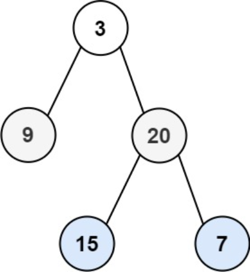

题目链接：[102-二叉树的层序遍历](https://leetcode-cn.com/problems/binary-tree-level-order-traversal/)

难度：<font color="Orange">中等</font>

题目内容：

给你二叉树的根节点 root ，返回其节点值的 层序遍历 。 （即逐层地，从左到右访问所有节点）。

示例 1：<br>
<br>
输入：root = [3,9,20,null,null,15,7]<br>
输出：\[[3],[9,20],[15,7]]

示例 2：<br>
输入：root = [1]<br>
输出：\[[1]]

示例 3：<br>
输入：root = []<br>
输出：[]

提示：<br>
树中节点数目在范围 [0, 2000] 内<br>
-1000 <= Node.val <= 1000


代码：
```
/**
 * Definition for a binary tree node.
 * struct TreeNode {
 *     int val;
 *     TreeNode *left;
 *     TreeNode *right;
 *     TreeNode() : val(0), left(nullptr), right(nullptr) {}
 *     TreeNode(int x) : val(x), left(nullptr), right(nullptr) {}
 *     TreeNode(int x, TreeNode *left, TreeNode *right) : val(x), left(left), right(right) {}
 * };
 */
class Solution {
public:
    vector<vector<int>> levelOrder(TreeNode* root) {
        vector<vector<int>> ans;
        if (root) {
            queue<TreeNode*> q;
            q.push(root);
            while (!q.empty()) {
                int len = q.size();
                vector<int> v;
                while (len--) {
                    TreeNode* temp = q.front();
                    v.push_back(temp->val);
                    if (temp->left)
                        q.push(temp->left);
                    if (temp->right)
                        q.push(temp->right);
                    q.pop();
                }
                ans.push_back(v);
            }
        }
        return ans;
    }
};
```