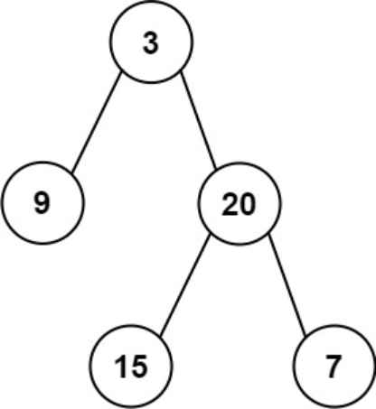

题目链接：[105-从前序与中序遍历序列构造二叉树](https://leetcode-cn.com/problems/construct-binary-tree-from-preorder-and-inorder-traversal/)

难度：<font color="Orange">中等</font>

题目内容：

给定两个整数数组 preorder 和 inorder ，其中 preorder 是二叉树的先序遍历， inorder 是同一棵树的中序遍历，请构造二叉树并返回其根节点。

示例 1:<br>
<br>
输入: preorder = [3,9,20,15,7], inorder = [9,3,15,20,7]<br>
输出: [3,9,20,null,null,15,7]

示例 2:<br>
输入: preorder = [-1], inorder = [-1]<br>
输出: [-1]

提示:<br>
1 <= preorder.length <= 3000<br>
inorder.length == preorder.length<br>
-3000 <= preorder[i], inorder[i] <= 3000<br>
preorder 和 inorder 均 无重复 元素<br>
inorder 均出现在 preorder<br>
preorder 保证 为二叉树的前序遍历序列<br>
inorder 保证 为二叉树的中序遍历序列


代码：
```
/**
 * Definition for a binary tree node.
 * struct TreeNode {
 *     int val;
 *     TreeNode *left;
 *     TreeNode *right;
 *     TreeNode() : val(0), left(nullptr), right(nullptr) {}
 *     TreeNode(int x) : val(x), left(nullptr), right(nullptr) {}
 *     TreeNode(int x, TreeNode *left, TreeNode *right) : val(x), left(left), right(right) {}
 * };
 */

// 递归，利用遍历特性切割中序遍历向量
class Solution {
public:
    TreeNode* buildTree(vector<int>& preorder, vector<int>& inorder) {
        if (inorder.empty())
            return nullptr;
        int ans_val = preorder[0];
        TreeNode* ans = new TreeNode(ans_val);
        int pos = find(inorder.begin(), inorder.end(), ans_val) - inorder.begin();
        vector<int> left_preorder(preorder.begin() + 1, preorder.begin() + pos + 1);
        vector<int> left_inorder(inorder.begin(), inorder.begin() + pos);
        vector<int> right_preorder(preorder.begin() + pos + 1, preorder.end());
        vector<int> right_inorder(inorder.begin() + pos + 1, inorder.end());
        ans->left = buildTree(left_preorder, left_inorder);
        ans->right = buildTree(right_preorder, right_inorder);
        return ans;
    }
};

// 递归，由于构造向量效率不高，因此考虑利用下标分割向量，只是此时需要仔细计算
class Solution {
public:
    TreeNode* build(vector<int>& preorder, vector<int>& inorder, int preorder_start, int preorder_finish, int inorder_start, int inorder_finish) {
        if (inorder_start > inorder_finish)
            return nullptr;
        int ans_val = preorder[preorder_start];
        TreeNode* ans = new TreeNode(ans_val);
        int left_len = find(inorder.begin() + inorder_start, inorder.begin() + inorder_finish + 1, ans_val) - inorder.begin() - inorder_start;
        int left_preorder_start = preorder_start + 1;
        int left_preorder_finish = preorder_start + left_len;
        int left_inorder_start = inorder_start;
        int left_inorder_finish = inorder_start + left_len - 1;
        int right_preorder_start = left_preorder_finish + 1;
        int right_preorder_finish = preorder_finish;
        int right_inorder_start = left_inorder_finish + 2;
        int right_inorder_finish = inorder_finish;
        ans->left = build(preorder, inorder, left_preorder_start, left_preorder_finish, left_inorder_start, left_inorder_finish);
        ans->right = build(preorder, inorder, right_preorder_start, right_preorder_finish, right_inorder_start, right_inorder_finish);
        return ans;
    }

    TreeNode* buildTree(vector<int>& preorder, vector<int>& inorder) {
        return build(preorder, inorder, 0, preorder.size() - 1, 0, inorder.size() - 1);
    }
};
```