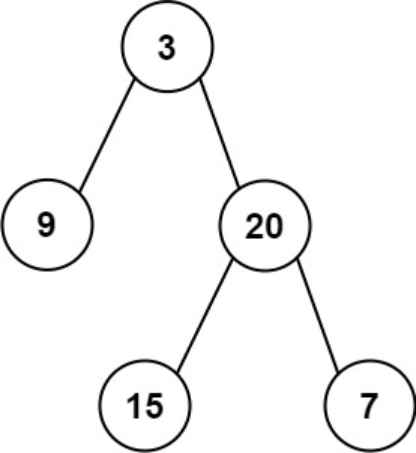

题目链接：[106-从中序与后序遍历序列构造二叉树](https://leetcode-cn.com/problems/construct-binary-tree-from-inorder-and-postorder-traversal/)

难度：<font color="Orange">中等</font>

题目内容：

给定两个整数数组 inorder 和 postorder ，其中 inorder 是二叉树的中序遍历， postorder 是同一棵树的后序遍历，请你构造并返回这颗 二叉树 。

示例 1:<br>
<br>
输入：inorder = [9,3,15,20,7], postorder = [9,15,7,20,3]<br>
输出：[3,9,20,null,null,15,7]

示例 2:<br>
输入：inorder = [-1], postorder = [-1]<br>
输出：[-1]

提示:<br>
1 <= inorder.length <= 3000<br>
postorder.length == inorder.length<br>
-3000 <= inorder[i], postorder[i] <= 3000<br>
inorder 和 postorder 都由 不同 的值组成<br>
postorder 中每一个值都在 inorder 中<br>
inorder 保证是树的中序遍历<br>
postorder 保证是树的后序遍历


代码：
```
/**
 * Definition for a binary tree node.
 * struct TreeNode {
 *     int val;
 *     TreeNode *left;
 *     TreeNode *right;
 *     TreeNode() : val(0), left(nullptr), right(nullptr) {}
 *     TreeNode(int x) : val(x), left(nullptr), right(nullptr) {}
 *     TreeNode(int x, TreeNode *left, TreeNode *right) : val(x), left(left), right(right) {}
 * };
 */

// 递归，利用遍历特性切割中序遍历向量
class Solution {
public:
    TreeNode* buildTree(vector<int>& inorder, vector<int>& postorder) {
        if (inorder.empty())
            return nullptr;
        int ans_val = postorder.back();
        TreeNode* ans = new TreeNode(ans_val);
        int pos = find(inorder.begin(), inorder.end(), ans_val) - inorder.begin();
        vector<int> left_inorder(inorder.begin(), inorder.begin() + pos);
        vector<int> left_postorder(postorder.begin(), postorder.begin() + pos);
        vector<int> right_inorder(inorder.begin() + pos + 1, inorder.end());
        vector<int> right_postorder(postorder.begin() + pos, postorder.end() - 1);
        ans->left = buildTree(left_inorder, left_postorder);
        ans->right = buildTree(right_inorder, right_postorder);
        return ans;
    }
};

// 递归，由于构造向量效率不高，因此考虑利用下标分割向量，只是此时需要仔细计算
class Solution {
public:
    TreeNode* build(vector<int>& inorder, vector<int>& postorder, int inorder_start, int inorder_finish, int postorder_start, int postorder_finish) {
        if (inorder_start > inorder_finish)
            return nullptr;
        int ans_val = postorder[postorder_finish];
        TreeNode* ans = new TreeNode(ans_val);
        int left_len = find(inorder.begin() + inorder_start, inorder.begin() + inorder_finish + 1, ans_val) - inorder.begin() - inorder_start;
        int left_inorder_start = inorder_start;
        int left_inorder_finish = inorder_start + left_len - 1;
        int left_postorder_start = postorder_start;
        int left_postorder_finish = postorder_start + left_len - 1;
        int right_inorder_start = left_inorder_finish + 2;
        int right_inorder_finish = inorder_finish;
        int right_postorder_start = left_postorder_finish + 1;
        int right_postorder_finish = postorder_finish - 1;
        ans->left = build(inorder, postorder, left_inorder_start, left_inorder_finish, left_postorder_start, left_postorder_finish);
        ans->right = build(inorder, postorder, right_inorder_start, right_inorder_finish, right_postorder_start, right_postorder_finish);
        return ans;
    }
    
    TreeNode* buildTree(vector<int>& inorder, vector<int>& postorder) {
        return build(inorder, postorder, 0, inorder.size() - 1, 0, postorder.size() - 1);
    }
};
```