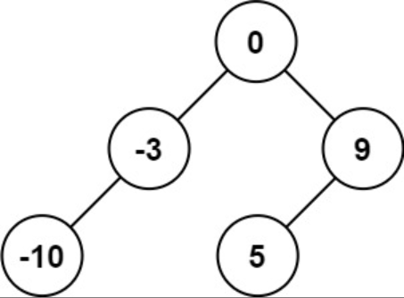
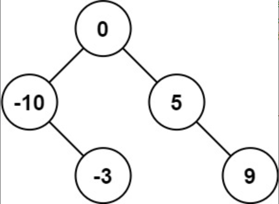
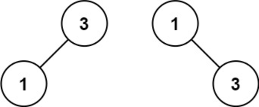

题目链接：[108-将有序数组转换为二叉搜索树](https://leetcode-cn.com/problems/convert-sorted-array-to-binary-search-tree/)

难度：<font color="Green">简单</font>

题目内容：

给你一个整数数组 nums ，其中元素已经按 升序 排列，请你将其转换为一棵 高度平衡 二叉搜索树。<br>
高度平衡 二叉树是一棵满足「每个节点的左右两个子树的高度差的绝对值不超过 1 」的二叉树。

示例 1：<br>
<br>
输入：nums = [-10,-3,0,5,9]<br>
输出：[0,-3,9,-10,null,5]<br>
解释：[0,-10,5,null,-3,null,9] 也将被视为正确答案：<br>


示例 2：<br>
<br>
输入：nums = [1,3]<br>
输出：[3,1]<br>
解释：[1,null,3] 和 [3,1] 都是高度平衡二叉搜索树。

提示：<br>
1 <= nums.length <= 10^4<br>
-10^4 <= nums[i] <= 10^4<br>
nums 按 严格递增 顺序排列


代码：
```
/**
 * Definition for a binary tree node.
 * struct TreeNode {
 *     int val;
 *     TreeNode *left;
 *     TreeNode *right;
 *     TreeNode() : val(0), left(nullptr), right(nullptr) {}
 *     TreeNode(int x) : val(x), left(nullptr), right(nullptr) {}
 *     TreeNode(int x, TreeNode *left, TreeNode *right) : val(x), left(left), right(right) {}
 * };
 */

// 递归，每次取中位数作为根节点val，递归构造左右子树
class Solution {
public:
    TreeNode* build(vector<int>& nums, int start, int finish) {
        if (start > finish)
            return nullptr;
        int middle = (start + finish) >> 1;
        TreeNode* ans = new TreeNode(nums[middle]);
        int left_start = start;
        int left_finish = middle - 1;
        int right_start = left_finish + 2;
        int right_finish = finish;
        ans->left = build(nums, left_start, left_finish);
        ans->right = build(nums, right_start, right_finish);
        return ans;
    }

    TreeNode* sortedArrayToBST(vector<int>& nums) {
        int len = nums.size();
        return build(nums, 0, len - 1);
    }
};

// 迭代，利用队列模拟分割向量的操作
class Solution {
public:
    TreeNode* sortedArrayToBST(vector<int>& nums) {
        if (nums.empty())
            return nullptr;
        queue<TreeNode*> node;
        queue<pair<int, int>> range;
        TreeNode* root = new TreeNode(0);
        node.push(root);
        range.push(make_pair(0, nums.size() - 1));
        while (!node.empty()) {
            TreeNode* temp = node.front();
            node.pop();
            auto r = range.front();
            range.pop();
            int mid = (r.first + r.second) >> 1;
            temp->val = nums[mid];
            if (r.first < mid) {
                temp->left = new TreeNode(0);
                node.push(temp->left);
                range.push(make_pair(r.first, mid - 1));
            } 
            if (r.second > mid) {
                temp->right = new TreeNode(0);
                node.push(temp->right);
                range.push(make_pair(mid + 1, r.second));
            } 
        } 
        return root;
    }
};
```