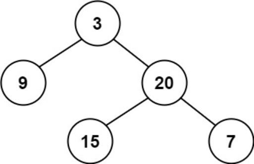
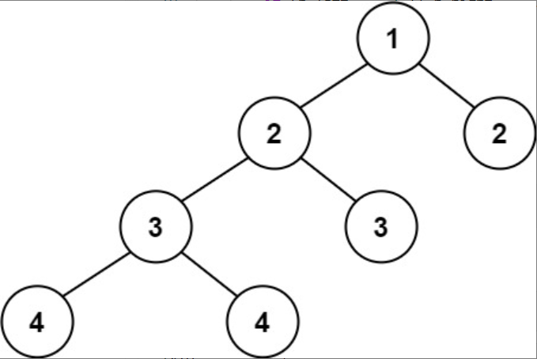

题目链接：[110-平衡二叉树](https://leetcode-cn.com/problems/balanced-binary-tree/)

难度：<font color="Green">简单</font>

题目内容：

给定一个二叉树，判断它是否是高度平衡的二叉树。<br>
本题中，一棵高度平衡二叉树定义为：<br>
一个二叉树每个节点 的左右两个子树的高度差的绝对值不超过 1 。

示例 1：<br>
<br>
输入：root = [3,9,20,null,null,15,7]<br>
输出：true

示例 2：<br>
<br>
输入：root = [1,2,2,3,3,null,null,4,4]<br>
输出：false

示例 3：<br>
输入：root = []<br>
输出：true

提示：<br>
树中的节点数在范围 [0, 5000] 内<br>
-10^4 <= Node.val <= 10^4


代码：
```
/**
 * Definition for a binary tree node.
 * struct TreeNode {
 *     int val;
 *     TreeNode *left;
 *     TreeNode *right;
 *     TreeNode() : val(0), left(nullptr), right(nullptr) {}
 *     TreeNode(int x) : val(x), left(nullptr), right(nullptr) {}
 *     TreeNode(int x, TreeNode *left, TreeNode *right) : val(x), left(left), right(right) {}
 * };
 */

// 递归，利用-1标记某树是否为平衡二叉树，如果不是平衡二叉树则返回高度无意义
class Solution {
public:
    int height(TreeNode* root)  {
        if (!root)
            return 0;
        int h_left = height(root->left);
        int h_right = height(root->right);
        if (h_left == -1 || h_right == -1 || abs(h_left - h_right) > 1)
            return -1;
        return max(h_left, h_right) + 1;
    }
    
    bool isBalanced(TreeNode* root) {
        return height(root) != -1; 
    }
};

// 迭代，后序遍历求高度和判断，但由于本题本质是回溯，迭代效率很低
class Solution {
public:
    int height(TreeNode* root)  {
        if (!root)
            return 0;
        int ans = 0;
        int depth = 0;
        stack<TreeNode*> s;
        s.push(root);
        while (!s.empty()) {
            TreeNode* temp = s.top();
            if (temp) {
                s.push(nullptr);
                ++depth;
                if (temp->right)
                    s.push(temp->right);
                if (temp->left)
                    s.push(temp->left);
            }
            else {
                s.pop();
                s.pop();
                --depth;
            }
            ans = max(ans, depth);
        }
        return ans;
    }

    bool isBalanced(TreeNode* root) {
        if (!root)
            return true;
        stack<TreeNode*> s;
        s.push(root);
        while (!s.empty()) {
            TreeNode* temp = s.top();
            if (temp) {
                s.push(nullptr);
                if (abs(height(temp->left) - height(temp->right)) > 1)
                    return false;
                if (temp->right)
                    s.push(temp->right);
                if (temp->left)
                    s.push(temp->left);
            }
            else {
                s.pop();
                s.pop();
            }
        }
        return true;
    }
};
```