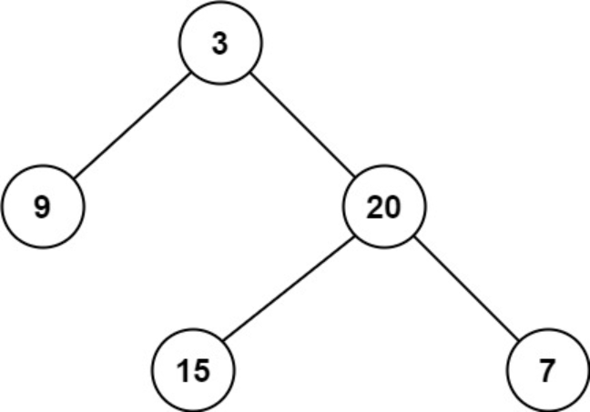

题目链接：[111-二叉树的最小深度](https://leetcode-cn.com/problems/minimum-depth-of-binary-tree/)

难度：<font color="Green">简单</font>

题目内容：

给定一个二叉树，找出其最小深度。<br>
最小深度是从根节点到最近叶子节点的最短路径上的节点数量。<br>
说明：叶子节点是指没有子节点的节点。

示例 1：<br>
<br>
输入：root = [3,9,20,null,null,15,7]<br>
输出：2

示例 2：<br>
输入：root = [2,null,3,null,4,null,5,null,6]<br>
输出：5

提示：<br>
树中节点数的范围在 [0, 10^5] 内<br>
-1000 <= Node.val <= 1000


代码：
```
/**
 * Definition for a binary tree node.
 * struct TreeNode {
 *     int val;
 *     TreeNode *left;
 *     TreeNode *right;
 *     TreeNode() : val(0), left(nullptr), right(nullptr) {}
 *     TreeNode(int x) : val(x), left(nullptr), right(nullptr) {}
 *     TreeNode(int x, TreeNode *left, TreeNode *right) : val(x), left(left), right(right) {}
 * };
 */

// 递归，利用后序遍历，注意处理左右子树为空的逻辑
class Solution {
public:
    int minDepth(TreeNode* root) {
        if (!root)
            return 0;
        int left_depth = minDepth(root->left);
        int right_depth = minDepth(root->right);
        if (!root->left)
            return right_depth + 1;
        if (!root->right)
            return left_depth + 1;
        return min(left_depth, right_depth) + 1;
    }
};

// 迭代，利用层序遍历
class Solution {
public:
    int minDepth(TreeNode* root) {
        int ans = 0;
        if (root) {
            queue<TreeNode*> q;
            q.push(root);
            while (!q.empty()) {
                ++ans;
                int len = q.size();
                while (len--) {
                    TreeNode* temp = q.front();
                    if (!temp->left && !temp->right)
                        return ans;
                    if (temp->left)
                        q.push(temp->left);
                    if (temp->right)
                        q.push(temp->right);
                    q.pop();
                }
            }
        }
        return ans;
    }
};
```