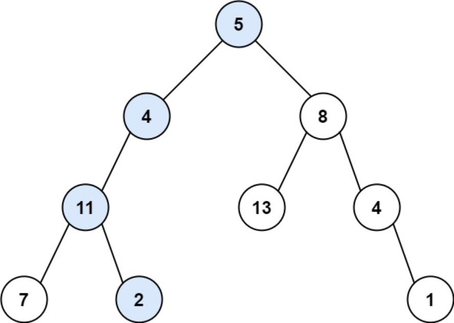
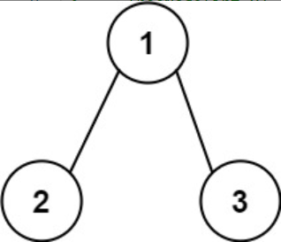

题目链接：[112-路径总和](https://leetcode-cn.com/problems/path-sum/)

难度：<font color="Green">简单</font>

题目内容：

给你二叉树的根节点 root 和一个表示目标和的整数 targetSum 。判断该树中是否存在 根节点到叶子节点 的路径，这条路径上所有节点值相加等于目标和 targetSum 。如果存在，返回 true ；否则，返回 false 。<br>
叶子节点 是指没有子节点的节点。

示例 1：<br>
<br>
输入：root = [5,4,8,11,null,13,4,7,2,null,null,null,1], targetSum = 22<br>
输出：true<br>
解释：等于目标和的根节点到叶节点路径如上图所示。

示例 2：<br>
<br>
输入：root = [1,2,3], targetSum = 5<br>
输出：false<br>
解释：树中存在两条根节点到叶子节点的路径：<br>
(1 --> 2): 和为 3<br>
(1 --> 3): 和为 4<br>
不存在 sum = 5 的根节点到叶子节点的路径。<br>

示例 3：<br>
输入：root = [], targetSum = 0<br>
输出：false<br>
解释：由于树是空的，所以不存在根节点到叶子节点的路径。

提示：<br>
树中节点的数目在范围 [0, 5000] 内<br>
-1000 <= Node.val <= 1000<br>
-1000 <= targetSum <= 1000


代码：
```
/**
 * Definition for a binary tree node.
 * struct TreeNode {
 *     int val;
 *     TreeNode *left;
 *     TreeNode *right;
 *     TreeNode() : val(0), left(nullptr), right(nullptr) {}
 *     TreeNode(int x) : val(x), left(nullptr), right(nullptr) {}
 *     TreeNode(int x, TreeNode *left, TreeNode *right) : val(x), left(left), right(right) {}
 * };
 */

// 递归，深度优先遍历
class Solution {
public:
    bool hasPathSum(TreeNode* root, int targetSum) {
        if (!root)
            return false;
        if (!root->left && !root->right)
            return root->val == targetSum;
        bool ans = false;
        return hasPathSum(root->left, targetSum - root->val) || hasPathSum(root->right, targetSum - root->val);
    }
};

// 迭代，前序遍历
class Solution {
public:
    bool hasPathSum(TreeNode* root, int targetSum) {
        if (root) {
            stack<pair<TreeNode*, int>> s;
            s.push(make_pair(root, root->val));
            while (!s.empty()) {
                auto p = s.top();
                TreeNode* temp = p.first;
                int num = p.second;
                if (temp) {
                    if (!temp->left && !temp->right && num == targetSum)
                        return true;
                    s.pop();
                    if (temp->right)
                        s.push(make_pair(temp->right, num + temp->right->val));
                    if (temp->left)
                        s.push(make_pair(temp->left, num + temp->left->val));
                    s.push(p);
                    s.push(make_pair(nullptr, 0));
                }
                else {
                    s.pop();
                    s.pop();
                }
            }
        }
        return false;
    }
};
```