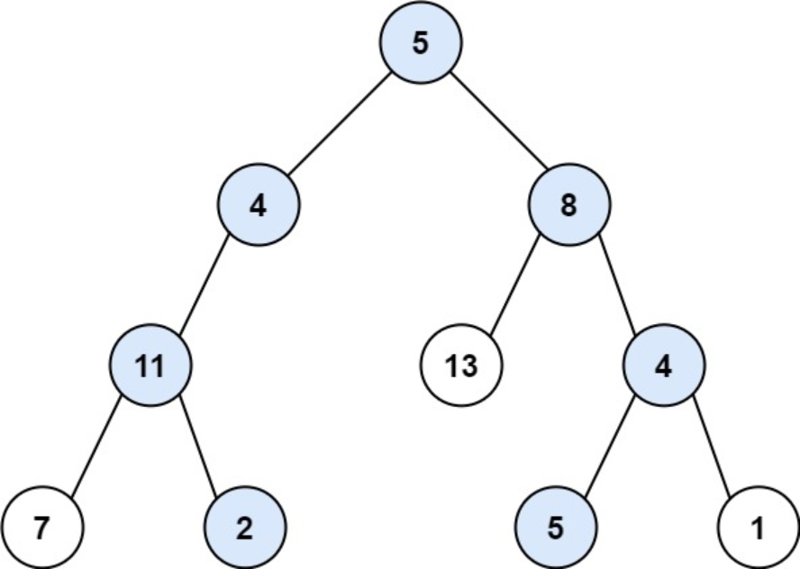
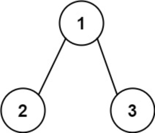

题目链接：[113-路径总和II](https://leetcode-cn.com/problems/path-sum-ii/)

难度：<font color="Orange">中等</font>

题目内容：

给你二叉树的根节点 root 和一个整数目标和 targetSum ，找出所有 从根节点到叶子节点 路径总和等于给定目标和的路径。<br>
叶子节点 是指没有子节点的节点。

示例 1：<br>
<br>
输入：root = [5,4,8,11,null,13,4,7,2,null,null,5,1], targetSum = 22<br>
输出：\[[5,4,11,2],[5,8,4,5]]

示例 2：<br>
<br>
输入：root = [1,2,3], targetSum = 5<br>
输出：[]

示例 3：<br>
输入：root = [1,2], targetSum = 0<br>
输出：[]

提示：<br>
树中节点总数在范围 [0, 5000] 内<br>
-1000 <= Node.val <= 1000<br>
-1000 <= targetSum <= 1000


代码：
```
/**
 * Definition for a binary tree node.
 * struct TreeNode {
 *     int val;
 *     TreeNode *left;
 *     TreeNode *right;
 *     TreeNode() : val(0), left(nullptr), right(nullptr) {}
 *     TreeNode(int x) : val(x), left(nullptr), right(nullptr) {}
 *     TreeNode(int x, TreeNode *left, TreeNode *right) : val(x), left(left), right(right) {}
 * };
 */

// 迭代保存路径较为繁琐，并不合适
// 递归，深度优先遍历
class Solution {
public:
    void dfs(TreeNode* node, int targetSum, vector<int>& path, vector<vector<int>>& ans) {
        path.push_back(node->val);
        if (!node->left && !node->right && node->val == targetSum)
            ans.push_back(path);
        else {
            if (node->left)
                dfs(node->left, targetSum - node->val, path, ans);
            if (node->right)
                dfs(node->right, targetSum - node->val, path, ans);
        }
        path.pop_back();
    }
    
    vector<vector<int>> pathSum(TreeNode* root, int targetSum) {
        if (!root) 
            return {};
        vector<vector<int>> ans;
        vector<int> path;
        dfs(root, targetSum, path, ans);
        return ans;
    }
};
```