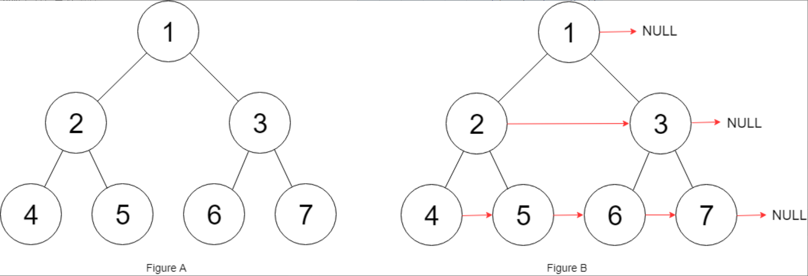

题目链接：[116-填充每个节点的下一个右侧节点指针](https://leetcode-cn.com/problems/populating-next-right-pointers-in-each-node/)

难度：<font color="Orange">中等</font>

题目内容：

给定一个 完美二叉树 ，其所有叶子节点都在同一层，每个父节点都有两个子节点。二叉树定义如下：
```
struct Node {
  int val;
  Node *left;
  Node *right;
  Node *next;
}
```
填充它的每个 next 指针，让这个指针指向其下一个右侧节点。如果找不到下一个右侧节点，则将 next 指针设置为 NULL。<br>
初始状态下，所有 next 指针都被设置为 NULL。

示例 1：<br>
<br>
输入：root = [1,2,3,4,5,6,7]<br>
输出：[1,#,2,3,#,4,5,6,7,#]<br>
解释：给定二叉树如图 A 所示，你的函数应该填充它的每个 next 指针，以指向其下一个右侧节点，如图 B 所示。序列化的输出按层序遍历排列，同一层节点由 next 指针连接，'#' 标志着每一层的结束。

示例 2:<br>
输入：root = []<br>
输出：[]

提示：<br>
树中节点的数量在 [0, 2^12 - 1] 范围内<br>
-1000 <= node.val <= 1000

进阶：<br>
你只能使用常量级额外空间。<br>
使用递归解题也符合要求，本题中递归程序占用的栈空间不算做额外的空间复杂度。


代码：
```
/*
// Definition for a Node.
class Node {
public:
    int val;
    Node* left;
    Node* right;
    Node* next;

    Node() : val(0), left(NULL), right(NULL), next(NULL) {}

    Node(int _val) : val(_val), left(NULL), right(NULL), next(NULL) {}

    Node(int _val, Node* _left, Node* _right, Node* _next)
        : val(_val), left(_left), right(_right), next(_next) {}
};
*/

class Solution {
public:
    Node* connect(Node* root) {
        if (root) {
            queue<Node*> q;
            vector<Node*> floor;
            q.push(root);
            while (!q.empty()) {
                int len = q.size();
                vector<Node*> v;
                while (len--) {
                    Node* temp = q.front();
                    v.push_back(temp);
                    if (temp->left)
                        q.push(temp->left);
                    if (temp->right)
                        q.push(temp->right);
                    q.pop();
                }
                int num = v.size();
                for (int i = 0; i < num - 1; ++i)
                    v[i]->next = v[i + 1];
            }
        }
        return root;
    }
};
```