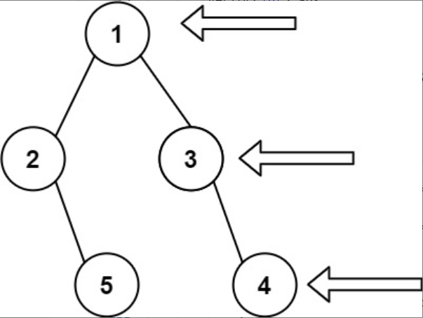

题目链接：[199-二叉树的右视图](https://leetcode-cn.com/problems/binary-tree-right-side-view/)

难度：<font color="Orange">中等</font>

题目内容：

给定一个二叉树的 根节点 root，想象自己站在它的右侧，按照从顶部到底部的顺序，返回从右侧所能看到的节点值。

示例 1:<br>
<br>
输入: [1,2,3,null,5,null,4]<br>
输出: [1,3,4]

示例 2:<br>
输入: [1,null,3]<br>
输出: [1,3]

示例 3:<br>
输入: []<br>
输出: []

提示:<br>
二叉树的节点个数的范围是 [0,100]<br>
-100 <= Node.val <= 100 


代码：
```
/**
 * Definition for a binary tree node.
 * struct TreeNode {
 *     int val;
 *     TreeNode *left;
 *     TreeNode *right;
 *     TreeNode() : val(0), left(nullptr), right(nullptr) {}
 *     TreeNode(int x) : val(x), left(nullptr), right(nullptr) {}
 *     TreeNode(int x, TreeNode *left, TreeNode *right) : val(x), left(left), right(right) {}
 * };
 */
class Solution {
public:
    vector<int> rightSideView(TreeNode* root) {
        vector<int> ans;
        if (root) {
            queue<TreeNode*> q;
            q.push(root);
            ans.push_back(root->val);
            while (!q.empty()) {
                int len = q.size();
                while (len--) {
                    TreeNode* temp = q.front();
                    if (temp->left)
                        q.push(temp->left);
                    if (temp->right)
                        q.push(temp->right);
                    q.pop();
                }
                if (!q.empty())
                    ans.push_back(q.back()->val);
            }
        }
        return ans;
    }
};
```