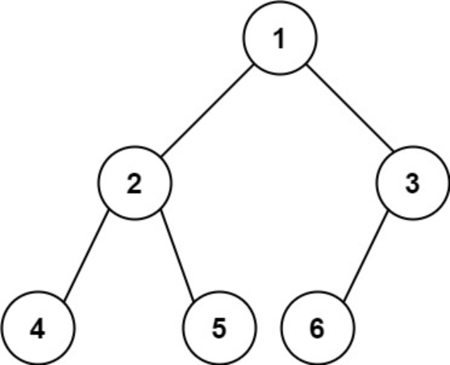

题目链接：[222-完全二叉树的节点个数](https://leetcode-cn.com/problems/count-complete-tree-nodes/)

难度：<font color="Orange">中等</font>

题目内容：

给你一棵 完全二叉树 的根节点 root ，求出该树的节点个数。<br>
完全二叉树 的定义如下：在完全二叉树中，除了最底层节点可能没填满外，其余每层节点数都达到最大值，并且最下面一层的节点都集中在该层最左边的若干位置。若最底层为第 h 层，则该层包含 1~ 2h 个节点。

示例 1：<br>
<br>
输入：root = [1,2,3,4,5,6]<br>
输出：6

示例 2：<br>
输入：root = []<br>
输出：0

示例 3：<br>
输入：root = [1]<br>
输出：1

提示：<br>
树中节点的数目范围是[0, 5 * 10^4]<br>
0 <= Node.val <= 5 * 10^4<br>
题目数据保证输入的树是 完全二叉树

进阶：遍历树来统计节点是一种时间复杂度为 O(n) 的简单解决方案。你可以设计一个更快的算法吗？


代码：
```
/**
 * Definition for a binary tree node.
 * struct TreeNode {
 *     int val;
 *     TreeNode *left;
 *     TreeNode *right;
 *     TreeNode() : val(0), left(nullptr), right(nullptr) {}
 *     TreeNode(int x) : val(x), left(nullptr), right(nullptr) {}
 *     TreeNode(int x, TreeNode *left, TreeNode *right) : val(x), left(left), right(right) {}
 * };
 */

// 按普通二叉树处理，递归，后序遍历
class Solution {
public:
    int countNodes(TreeNode* root) {
        if (!root)
            return 0;
        return countNodes(root->left) + countNodes(root->right) + 1;
    }
};

// 按普通二叉树处理，迭代，层序遍历
class Solution {
public:
    int countNodes(TreeNode* root) {
        int ans = 0;
        if (root) {
            queue<TreeNode*> q;
            q.push(root);
            ++ans;
            while (!q.empty()) {
                TreeNode* temp = q.front();
                q.pop();
                if (temp->left) {
                    q.push(temp->left);
                    ++ans;
                }
                if (temp->right) {
                    q.push(temp->right);
                    ++ans;
                }
            }
        }
        return ans;
    }
};

// 利用完全二叉树的特性，可知某子树一定是满二叉树，而满二叉树可以用高度判断
class Solution {
public:
    int countNodes(TreeNode* root) {
        if (!root)
            return 0;
        int left_height = 0;
        int right_height = 0;
        for (TreeNode* p = root; p; p = p->left)
            ++left_height;
        for (TreeNode* p = root; p; p = p->right)
            ++right_height;
        if (left_height == right_height)
            return (1 << left_height) - 1;
        return countNodes(root->left) + countNodes(root->right) + 1;
    }
};
```