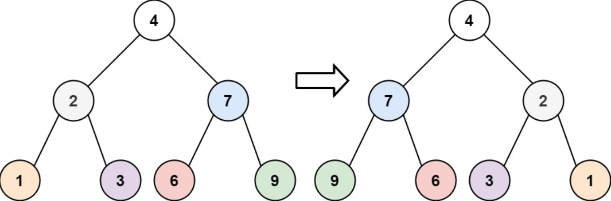
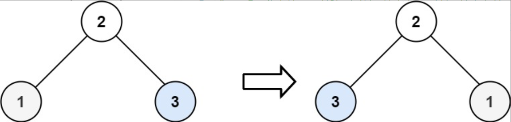

题目链接：[226-翻转二叉树](https://leetcode-cn.com/problems/invert-binary-tree/)

难度：<font color="Green">简单</font>

题目内容：

给你一棵二叉树的根节点 root ，翻转这棵二叉树，并返回其根节点。

示例 1：<br>
<br>
输入：root = [4,2,7,1,3,6,9]<br>
输出：[4,7,2,9,6,3,1]

示例 2：<br>
<br>
输入：root = [2,1,3]<br>
输出：[2,3,1]

示例 3：<br>
输入：root = []<br>
输出：[]

提示：<br>
树中节点数目范围在 [0, 100] 内<br>
-100 <= Node.val <= 100


代码：
```
/**
 * Definition for a binary tree node.
 * struct TreeNode {
 *     int val;
 *     TreeNode *left;
 *     TreeNode *right;
 *     TreeNode() : val(0), left(nullptr), right(nullptr) {}
 *     TreeNode(int x) : val(x), left(nullptr), right(nullptr) {}
 *     TreeNode(int x, TreeNode *left, TreeNode *right) : val(x), left(left), right(right) {}
 * };
 */

// 递归，前序遍历的顺序
class Solution {
public:
    TreeNode* invertTree(TreeNode* root) {
        if (root) {
            swap(root->left, root->right);
            root->left = invertTree(root->left);
            root->right = invertTree(root->right);
        }
        return root;
    }
};

// 递归，后序遍历的顺序
class Solution {
public:
    TreeNode* invertTree(TreeNode* root) {
        if (root) {
            root->left = invertTree(root->left);
            root->right = invertTree(root->right);
            swap(root->left, root->right);
        }
        return root;
    }
};

// 递归，如果按中序遍历的顺序，需要稍微修改一下，因为左子树内部已经翻转，随后整体被翻转成右子树，因此之后不能再翻转右子树，但这并非真正的中序遍历
class Solution {
public:
    TreeNode* invertTree(TreeNode* root) {
        if (root) {
            root->left = invertTree(root->left);
            swap(root->left, root->right);
            root->left = invertTree(root->left);
        }
        return root;
    }
};

// 迭代，前序遍历的顺序
class Solution {
public:
    TreeNode* invertTree(TreeNode* root) {
        if (root) {
            stack<TreeNode*> s;
            s.push(root);
            while (!s.empty()) {
                TreeNode* temp = s.top();
                if (temp) {
                    s.pop();
                    swap(temp->left, temp->right);
                    if (temp->right)
                        s.push(temp->right);
                    if (temp->left)
                        s.push(temp->left);
                    s.push(temp);
                    s.push(nullptr);
                }
                else {
                    s.pop();
                    s.pop();
                }
            }
        }
        return root;
    }
};

// 迭代，后序遍历的顺序
class Solution {
public:
    TreeNode* invertTree(TreeNode* root) {
        if (root) {
            stack<TreeNode*> s;
            s.push(root);
            while (!s.empty()) {
                TreeNode* temp = s.top();
                if (temp) {
                    s.push(nullptr);
                    swap(temp->left, temp->right);
                    if (temp->right)
                        s.push(temp->right);
                    if (temp->left)
                        s.push(temp->left);
                }
                else {
                    s.pop();
                    s.pop();
                }
            }
        }
        return root;
    }
};

// 迭代，中序遍历的顺序，由于是利用栈存储节点，因此避免了子树重复翻转的问题
class Solution {
public:
    TreeNode* invertTree(TreeNode* root) {
        if (root) {
            stack<TreeNode*> s;
            s.push(root);
            while (!s.empty()) {
                TreeNode* temp = s.top();
                if (temp) {
                    s.pop();
                    swap(temp->left, temp->right);
                    if (temp->right)
                        s.push(temp->right);
                    s.push(temp);
                    s.push(nullptr);
                    if (temp->left)
                        s.push(temp->left);
                }
                else {
                    s.pop();
                    s.pop();
                }
            }
        }
        return root;
    }
};

// 层序遍历
class Solution {
public:
    TreeNode* invertTree(TreeNode* root) {
        if (root) {
            queue<TreeNode*> q;
            q.push(root);
            while (!q.empty()) {
                int len = q.size();
                while (len--) {
                    TreeNode* temp = q.front();
                    swap(temp->left, temp->right);
                    if (temp->left)
                        q.push(temp->left);
                    if (temp->right)
                        q.push(temp->right);
                    q.pop();
                }
            }
        }
        return root;
    }
};
```