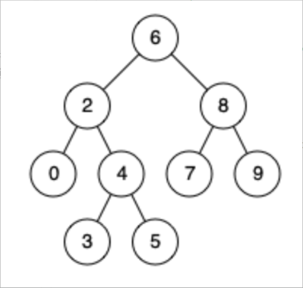

题目链接：[235-二叉搜索树的最近公共祖先](https://leetcode-cn.com/problems/lowest-common-ancestor-of-a-binary-search-tree/)

难度：<font color="Green">简单</font>

题目内容：

给定一个二叉搜索树, 找到该树中两个指定节点的最近公共祖先。<br>
百度百科中最近公共祖先的定义为：“对于有根树 T 的两个结点 p、q，最近公共祖先表示为一个结点 x，满足 x 是 p、q 的祖先且 x 的深度尽可能大（一个节点也可以是它自己的祖先）。”<br>
例如，给定如下二叉搜索树:  root = [6,2,8,0,4,7,9,null,null,3,5]<br>


示例 1:<br>
输入: root = [6,2,8,0,4,7,9,null,null,3,5], p = 2, q = 8<br>
输出: 6 <br>
解释: 节点 2 和节点 8 的最近公共祖先是 6。

示例 2:<br>
输入: root = [6,2,8,0,4,7,9,null,null,3,5], p = 2, q = 4<br>
输出: 2<br>
解释: 节点 2 和节点 4 的最近公共祖先是 2, 因为根据定义最近公共祖先节点可以为节点本身。

说明:<br>
所有节点的值都是唯一的。<br>
p、q 为不同节点且均存在于给定的二叉搜索树中。


代码：
```
/**
 * Definition for a binary tree node.
 * struct TreeNode {
 *     int val;
 *     TreeNode *left;
 *     TreeNode *right;
 *     TreeNode(int x) : val(x), left(NULL), right(NULL) {}
 * };
 */

// 递归，由于二叉搜索树有序，只需根据区间判断即可，无需回溯
class Solution {
public:
    TreeNode* lowestCommonAncestor(TreeNode* root, TreeNode* p, TreeNode* q) {
        if (root->val > p->val && root->val > q->val)
            return lowestCommonAncestor(root->left, p, q);
        if (root->val < p->val && root->val < q->val)
            return lowestCommonAncestor(root->right, p, q);
        return root;
    }
};

// 迭代
class Solution {
public:
    TreeNode* lowestCommonAncestor(TreeNode* root, TreeNode* p, TreeNode* q) {
        TreeNode* ans = root;
        while (ans) {
            if (ans->val > p->val && ans->val > q->val)
                return lowestCommonAncestor(ans->left, p, q);
            if (ans->val < p->val && ans->val < q->val)
                return lowestCommonAncestor(ans->right, p, q);
            return root;
        }
        return nullptr;
    }
};
```