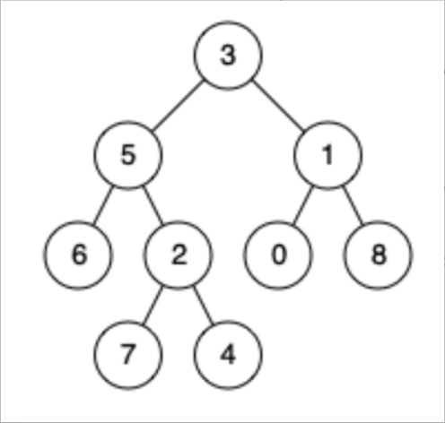

题目链接：[236-二叉树的最近公共祖先](https://leetcode-cn.com/problems/lowest-common-ancestor-of-a-binary-tree/)

难度：<font color="Orange">中等</font>

题目内容：

给定一个二叉树, 找到该树中两个指定节点的最近公共祖先。<br>
百度百科中最近公共祖先的定义为：“对于有根树 T 的两个节点 p、q，最近公共祖先表示为一个节点 x，满足 x 是 p、q 的祖先且 x 的深度尽可能大（一个节点也可以是它自己的祖先）。”

示例 1：<br>
<br>
输入：root = [3,5,1,6,2,0,8,null,null,7,4], p = 5, q = 1<br>
输出：3<br>
解释：节点 5 和节点 1 的最近公共祖先是节点 3 。

示例 2：<br>
<br>
输入：root = [3,5,1,6,2,0,8,null,null,7,4], p = 5, q = 4<br>
输出：5<br>
解释：节点 5 和节点 4 的最近公共祖先是节点 5 。因为根据定义最近公共祖先节点可以为节点本身。

示例 3：<br>
输入：root = [1,2], p = 1, q = 2<br>
输出：1

提示：<br>
树中节点数目在范围 [2, 10^5] 内。<br>
-10^9 <= Node.val <= 10^9<br>
所有 Node.val 互不相同 。<br>
p != q<br>
p 和 q 均存在于给定的二叉树中。


代码：
```
/**
 * Definition for a binary tree node.
 * struct TreeNode {
 *     int val;
 *     TreeNode *left;
 *     TreeNode *right;
 *     TreeNode(int x) : val(x), left(NULL), right(NULL) {}
 * };
 */

// 递归，考虑后序遍历中隐藏的回溯思想，可以画图帮助理解
class Solution {
public:
    TreeNode* lowestCommonAncestor(TreeNode* root, TreeNode* p, TreeNode* q) {
        if (!root || root == p || root == q)
            return root;
        TreeNode* lchild = lowestCommonAncestor(root->left, p, q);
        TreeNode* rchild = lowestCommonAncestor(root->right, p, q);
        if ((lchild == p && rchild == q) || (lchild == q && rchild == p))
            return root;
        if (!lchild)
            return rchild;
        return lchild;
    }
};
```