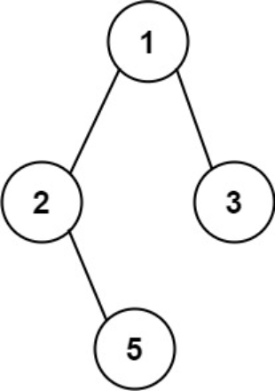

题目链接：[257-二叉树的所有路径](https://leetcode-cn.com/problems/binary-tree-paths/)

难度：<font color="Green">简单</font>

题目内容：

给你一个二叉树的根节点 root ，按 任意顺序 ，返回所有从根节点到叶子节点的路径。<br>
叶子节点 是指没有子节点的节点。

示例 1：<br>
<br>
输入：root = [1,2,3,null,5]<br>
输出：["1->2->5","1->3"]

示例 2：<br>
输入：root = [1]<br>
输出：["1"]

提示：<br>
树中节点的数目在范围 [1, 100] 内<br>
-100 <= Node.val <= 100


代码：
```
/**
 * Definition for a binary tree node.
 * struct TreeNode {
 *     int val;
 *     TreeNode *left;
 *     TreeNode *right;
 *     TreeNode() : val(0), left(nullptr), right(nullptr) {}
 *     TreeNode(int x) : val(x), left(nullptr), right(nullptr) {}
 *     TreeNode(int x, TreeNode *left, TreeNode *right) : val(x), left(left), right(right) {}
 * };
 */

// 递归
class Solution {
public:
    void dfs(TreeNode* node, vector<int>& path, vector<string>& ans) {
        path.push_back(node->val);
        if (!node->left && !node->right) {
            int len = path.size();
            string str = "";
            for (int i = 0; i < len - 1; ++i)
                str += to_string(path[i]) + "->";
            str += to_string(path.back());
            ans.push_back(str);
        }
        else {
            if (node->left) {
                dfs(node->left, path, ans);
                path.pop_back();
            }
            if (node->right) {
                dfs(node->right, path, ans);
                path.pop_back();
            }
        }
    }
    vector<string> binaryTreePaths(TreeNode* root) {
        if (!root)
            return {};
        vector<string> ans;
        vector<int> path;
        dfs(root, path, ans);
        return ans;
    }
};

// 迭代，前序遍历，由于回溯，迭代法会比较难理解，建议画图辅助理解
class Solution {
public:
    vector<string> binaryTreePaths(TreeNode* root) {
        if (!root)
            return {};
        vector<string> ans;
        stack<TreeNode*> node;
        stack<string> path;
        node.push(root);
        path.push(to_string(root->val));
        while (!node.empty()) {
            TreeNode* temp = node.top();
            if (temp) {
                string str = path.top();
                node.pop();
                if (!temp->left && !temp->right)
                    ans.push_back(str);
                path.pop();
                if (temp->right) {
                    node.push(temp->right);
                    path.push(str + "->" + to_string(temp->right->val));
                }
                if (temp->left) {
                    node.push(temp->left);
                    path.push(str + "->" + to_string(temp->left->val));
                }
                node.push(temp);
                node.push(nullptr);
            }
            else {
                node.pop();
                node.pop();
            }
        }
        return ans;
    }
};
```