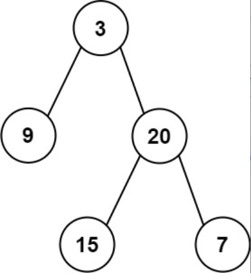

题目链接：[404-左叶子之和](https://leetcode-cn.com/problems/sum-of-left-leaves/)

难度：<font color="Green">简单</font>

题目内容：

给定二叉树的根节点 root ，返回所有左叶子之和。

示例 1：<br>
<br>
输入: root = [3,9,20,null,null,15,7] <br>
输出: 24 <br>
解释: 在这个二叉树中，有两个左叶子，分别是 9 和 15，所以返回 24

示例 2:<br>
输入: root = [1]<br>
输出: 0

提示:<br>
节点数在 [1, 1000] 范围内<br>
-1000 <= Node.val <= 1000


代码：
```
/**
 * Definition for a binary tree node.
 * struct TreeNode {
 *     int val;
 *     TreeNode *left;
 *     TreeNode *right;
 *     TreeNode() : val(0), left(nullptr), right(nullptr) {}
 *     TreeNode(int x) : val(x), left(nullptr), right(nullptr) {}
 *     TreeNode(int x, TreeNode *left, TreeNode *right) : val(x), left(left), right(right) {}
 * };
 */

// 递归，后序遍历
class Solution {
public:
    int sumOfLeftLeaves(TreeNode* root) {
        if (!root)
            return 0;
        if (root->left && !root->left->left && !root->left->right)
            return root->left->val + sumOfLeftLeaves(root->right);
        return sumOfLeftLeaves(root->left) + sumOfLeftLeaves(root->right);
    }
};

// 迭代
class Solution {
public:
    int sumOfLeftLeaves(TreeNode* root) {
        int ans = 0;
        if (root) {
            stack<TreeNode*> s;
            s.push(root);
            while (!s.empty()) {
                TreeNode* temp = s.top();
                if (temp) {
                    s.push(nullptr);
                    if (temp->right)
                        s.push(temp->right);
                    if (temp->left) {
                        s.push(temp->left);
                        if (!temp->left->left && !temp->left->right)
                            ans += temp->left->val;
                    }
                }
                else {
                    s.pop();
                    s.pop();
                }
            }
        }
        return ans;
    }
};
```