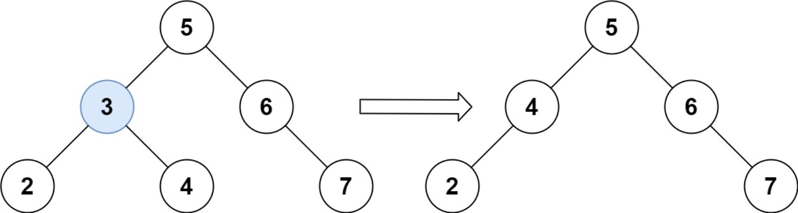
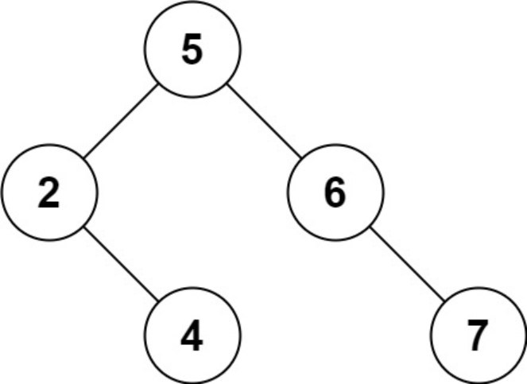

题目链接：[450-删除二叉搜索树中的节点](https://leetcode-cn.com/problems/delete-node-in-a-bst/)

难度：<font color="Orange">中等</font>

题目内容：

给定一个二叉搜索树的根节点 root 和一个值 key，删除二叉搜索树中的 key 对应的节点，并保证二叉搜索树的性质不变。返回二叉搜索树（有可能被更新）的根节点的引用。<br>
一般来说，删除节点可分为两个步骤：<br>
首先找到需要删除的节点；<br>
如果找到了，删除它。

示例 1:<br>
<br>
输入：root = [5,3,6,2,4,null,7], key = 3<br>
输出：[5,4,6,2,null,null,7]<br>
解释：给定需要删除的节点值是 3，所以我们首先找到 3 这个节点，然后删除它。<br>
一个正确的答案是 [5,4,6,2,null,null,7], 如图所示。<br>
另一个正确答案是 [5,2,6,null,4,null,7]。<br>


示例 2:<br>
输入: root = [5,3,6,2,4,null,7], key = 0<br>
输出: [5,3,6,2,4,null,7]<br>
解释: 二叉树不包含值为 0 的节点

示例 3:<br>
输入: root = [], key = 0<br>
输出: []

提示:<br>
节点数的范围 [0, 10^4].<br>
-10^5 <= Node.val <= 10^5<br>
节点值唯一<br>
root 是合法的二叉搜索树<br>
-10^5 <= key <= 10^5<br>

进阶： 要求算法时间复杂度为 O(h)，h 为树的高度。


代码：
```
/**
 * Definition for a binary tree node.
 * struct TreeNode {
 *     int val;
 *     TreeNode *left;
 *     TreeNode *right;
 *     TreeNode() : val(0), left(nullptr), right(nullptr) {}
 *     TreeNode(int x) : val(x), left(nullptr), right(nullptr) {}
 *     TreeNode(int x, TreeNode *left, TreeNode *right) : val(x), left(left), right(right) {}
 * };
 */

// 递归，二叉搜索树节点删除方法，后面会总结
class Solution {
public:
    TreeNode* deleteNode(TreeNode* root, int key) {
        if (!root)
            return nullptr;
        if (root->val > key) {
            root->left = deleteNode(root->left, key);
            return root;
        }
        else if (root->val < key) {
            root->right = deleteNode(root->right, key);
            return root;
        }
        else {
            if (!root->left && !root->right) {
                delete root;
                return nullptr;
            }
            if (!root->left) {
                TreeNode* ans = root->right;
                delete root;
                return ans;
            }
            if (!root->right) {
                TreeNode* ans = root->left;
                delete root;
                return ans;
            }
            TreeNode* temp = root->right;
            while (temp->left)
                temp = temp->left;
            temp->left = root->left;
            TreeNode* ans = root->right;
            delete root;
            return ans;
        }
    }
};

// 迭代，注意头节点的情况，当然也可以对头结点情况单独处理
class Solution {
public:
    TreeNode* del(TreeNode* target) {
        if (!target->left && !target->right) {
            delete target;
            return nullptr;
        }
        if (!target->left) {
            TreeNode* ans = target->right;
            delete target;
            return ans;
        }
        if (!target->right) {
            TreeNode* ans = target->left;
            delete target;
            return ans;
        }
        TreeNode* temp = target->right;
        while (temp->left)
            temp = temp->left;
        temp->left = target->left;
        TreeNode* ans = target->right;
        delete target;
        return ans;
    }

    TreeNode* deleteNode(TreeNode* root, int key) {
        if (!root)
            return nullptr;
        TreeNode* new_root = new TreeNode(-1);
        new_root->right = root;
        TreeNode* target = root;
        TreeNode* parent = new_root;
        while (target) {
            if (target->val == key)
                break;
            parent = target;
            if (target->val > key)
                target = target->left;
            else if (target->val < key)
                target = target->right;
        }
        if (target) {
            if (parent->left == target)
                parent->left = del(target);
            else
                parent->right = del(target);
        }
        root = new_root->right;
        delete new_root;
        return root;
    }
};
```