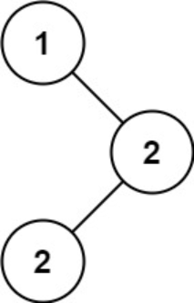

题目链接：[501-二叉搜索树中的众数](https://leetcode-cn.com/problems/find-mode-in-binary-search-tree/)

难度：<font color="Green">简单</font>

题目内容：

给你一个含重复值的二叉搜索树（BST）的根节点 root ，找出并返回 BST 中的所有 众数（即，出现频率最高的元素）。<br>
如果树中有不止一个众数，可以按 任意顺序 返回。<br>
假定 BST 满足如下定义：<br>
结点左子树中所含节点的值 小于等于 当前节点的值<br>
结点右子树中所含节点的值 大于等于 当前节点的值<br>
左子树和右子树都是二叉搜索树

示例 1：<br>
<br>
输入：root = [1,null,2,2]<br>
输出：[2]

示例 2：<br>
输入：root = [0]<br>
输出：[0]

提示：<br>
树中节点的数目在范围 [1, 10^4] 内<br>
-10^5 <= Node.val <= 10^5

进阶：你可以不使用额外的空间吗？（假设由递归产生的隐式调用栈的开销不被计算在内）


代码：
```
/**
 * Definition for a binary tree node.
 * struct TreeNode {
 *     int val;
 *     TreeNode *left;
 *     TreeNode *right;
 *     TreeNode() : val(0), left(nullptr), right(nullptr) {}
 *     TreeNode(int x) : val(x), left(nullptr), right(nullptr) {}
 *     TreeNode(int x, TreeNode *left, TreeNode *right) : val(x), left(left), right(right) {}
 * };
 */

// 由于不能使用额外的空间，因此不能使用迭代，迭代至少需要一个栈，考虑使用递归
// 由于ans是返回结果，因此不计入额外空间
class Solution {
public:
    vector<int> ans;
    int flag = -1;
    int max_count = 0;
    int count = 0;
    void inorder(TreeNode* root) {
        if (root) {
            inorder(root->left);
            if (root->val == flag)
                ++count;
            else
                count = 1;
            flag = root->val;
            if (count >= max_count) {
                if (count > max_count) {
                    ans.clear();
                    max_count = count;
                }
                ans.push_back(root->val);
            }
            inorder(root->right);
        }
    }

    vector<int> findMode(TreeNode* root) {
        inorder(root);
        return ans;
    }
};
```