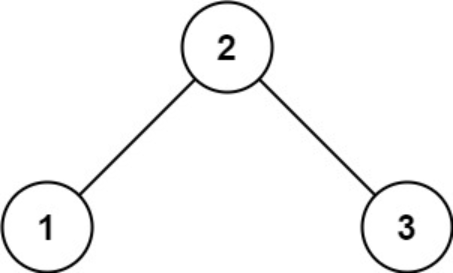
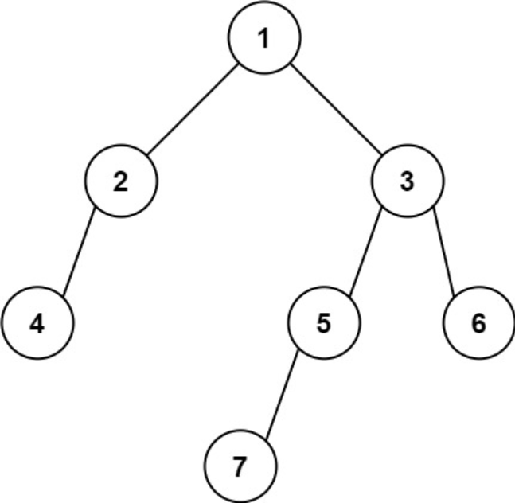

题目链接：[513-找树左下角的值](https://leetcode-cn.com/problems/find-bottom-left-tree-value/)

难度：<font color="Orange">中等</font>

题目内容：

给定一个二叉树的 根节点 root，请找出该二叉树的 最底层 最左边 节点的值。<br>
假设二叉树中至少有一个节点。

示例 1:<br>
<br>
输入: root = [2,1,3]<br>
输出: 1

示例 2:<br>
<br>
输入: [1,2,3,4,null,5,6,null,null,7]<br>
输出: 7

提示:<br>
二叉树的节点个数的范围是 [1,10^4]<br>
-2^31 <= Node.val <= 2^31 - 1 


代码：
```
/**
 * Definition for a binary tree node.
 * struct TreeNode {
 *     int val;
 *     TreeNode *left;
 *     TreeNode *right;
 *     TreeNode() : val(0), left(nullptr), right(nullptr) {}
 *     TreeNode(int x) : val(x), left(nullptr), right(nullptr) {}
 *     TreeNode(int x, TreeNode *left, TreeNode *right) : val(x), left(left), right(right) {}
 * };
 */

// 递归，思路：找树的最大深度，利用判断条件保证结果是最左侧节点
class Solution {
public:
    int max_dep = -1;
    int ans;
    void dfs(TreeNode* node, int depth) {
        if (!node->left && !node->right) {
            if (max_dep < depth) {
                max_dep = depth;
                ans = node->val;
            }
        }
        if (node->left)
            dfs(node->left, depth + 1);
        if (node->right)
            dfs(node->right, depth + 1);
    }
    int findBottomLeftValue(TreeNode* root) {
        dfs(root, 0);
        return ans;
    }
};

// 迭代，层序遍历
class Solution {
public:
    int findBottomLeftValue(TreeNode* root) {
        queue<TreeNode*> q;
        q.push(root);
        TreeNode* ans = nullptr;
        while (!q.empty()) {
            ans = q.front();
            int num = q.size();
            while (num--) {
                TreeNode* temp = q.front();
                q.pop();
                if (temp->left)
                    q.push(temp->left);
                if (temp->right)
                    q.push(temp->right);
            }
        }
        return ans->val;
    }
};
```