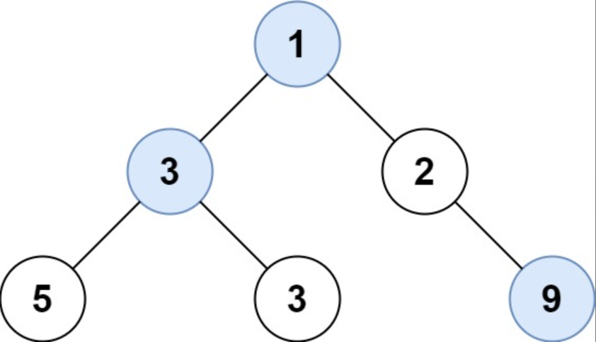

题目链接：[515-在每个树行中找最大值](https://leetcode-cn.com/problems/find-largest-value-in-each-tree-row/)

难度：<font color="Orange">中等</font>

题目内容：

给定一棵二叉树的根节点 root ，请找出该二叉树中每一层的最大值。

示例1：<br>
<br>
输入: root = [1,3,2,5,3,null,9]<br>
输出: [1,3,9]

示例2：<br>
输入: root = [1,2,3]<br>
输出: [1,3]

提示：<br>
二叉树的节点个数的范围是 [0,10^4]<br>
-2^31 <= Node.val <= 2^31 - 1


代码：
```
/**
 * Definition for a binary tree node.
 * struct TreeNode {
 *     int val;
 *     TreeNode *left;
 *     TreeNode *right;
 *     TreeNode() : val(0), left(nullptr), right(nullptr) {}
 *     TreeNode(int x) : val(x), left(nullptr), right(nullptr) {}
 *     TreeNode(int x, TreeNode *left, TreeNode *right) : val(x), left(left), right(right) {}
 * };
 */
class Solution {
public:
    vector<int> largestValues(TreeNode* root) {
        vector<int> ans;
        if (root) {
            queue<TreeNode*> q;
            q.push(root);
            while (!q.empty()) {
                int len = q.size();
                int num = INT_MIN;
                while (len--) {
                    TreeNode* temp = q.front();
                    num = max(num, temp->val);
                    if (temp->left)
                        q.push(temp->left);
                    if (temp->right)
                        q.push(temp->right);
                    q.pop();
                }
                ans.push_back(num);
            }
        }
        return ans;
    }
};
```