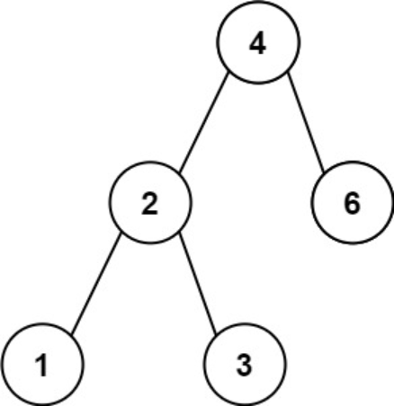
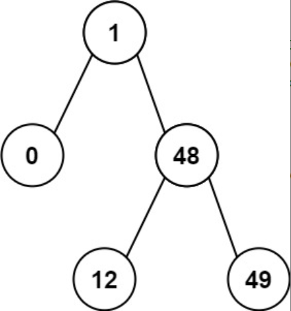

题目链接：[530-二叉搜索树的最小绝对差](https://leetcode-cn.com/problems/minimum-absolute-difference-in-bst/)

难度：<font color="Green">简单</font>

题目内容：

给你一个二叉搜索树的根节点 root ，返回 树中任意两不同节点值之间的最小差值 。<br>
差值是一个正数，其数值等于两值之差的绝对值。

示例 1：<br>
<br>
输入：root = [4,2,6,1,3]<br>
输出：1

示例 2：<br>
<br>
输入：root = [1,0,48,null,null,12,49]<br>
输出：1

提示：<br>
树中节点的数目范围是 [2, 10^4]<br>
0 <= Node.val <= 10^5


代码：
```
/**
 * Definition for a binary tree node.
 * struct TreeNode {
 *     int val;
 *     TreeNode *left;
 *     TreeNode *right;
 *     TreeNode() : val(0), left(nullptr), right(nullptr) {}
 *     TreeNode(int x) : val(x), left(nullptr), right(nullptr) {}
 *     TreeNode(int x, TreeNode *left, TreeNode *right) : val(x), left(left), right(right) {}
 * };
 */

// 递归，中序遍历转化成数组，判断是否递增
class Solution {
public:
    void inorder(TreeNode* root, vector<int>& order) {
        if (root) {
            inorder(root->left, order);
            order.push_back(root->val);
            inorder(root->right, order);
        }
    }

    int getMinimumDifference(TreeNode* root) {
        vector<int> order;
        inorder(root, order);
        int ans = order[1] - order[0];
        int len = order.size();
        for (int i = 2; i < len; ++i)
            ans = min(ans, order[i] - order[i - 1]);
        return ans;
    }
};

// 递归，在中序遍历过程中比较，无需建立数组
class Solution {
public:
    int flag = -1;
    int ans = INT_MAX;
    int getMinimumDifference(TreeNode* root) {
        if (root) {
            getMinimumDifference(root->left);
            if (flag != -1)
                ans = min(ans, root->val - flag);
            flag = root->val;
            getMinimumDifference(root->right);
        }
        return ans;
    }
};

// 迭代，中序遍历转化成数组，判断是否递增
class Solution {
public:
    void inorder(TreeNode* root, vector<int>& order) {
        if (root) {
            stack<TreeNode*> s;
            s.push(root);
            while (!s.empty()) {
                TreeNode* temp = s.top();
                if (temp) {
                    s.pop();
                    if (temp->right)
                        s.push(temp->right);
                    s.push(temp);
                    s.push(nullptr);
                    if (temp->left)
                        s.push(temp->left);
                }
                else {
                    s.pop();
                    order.push_back(s.top()->val);
                    s.pop();
                }
            }
        }
    }

    int getMinimumDifference(TreeNode* root) {
        vector<int> order;
        inorder(root, order);
        int ans = order[1] - order[0];
        int len = order.size();
        for (int i = 2; i < len; ++i)
            ans = min(ans, order[i] - order[i - 1]);
        return ans;
    }
};

// 迭代，在中序遍历过程中比较，无需建立数组
class Solution {
public:
    int flag = -1;
    int ans = INT_MAX;
    int getMinimumDifference(TreeNode* root) {
        if (root) {
            stack<TreeNode*> s;
            s.push(root);
            while (!s.empty()) {
                TreeNode* temp = s.top();
                if (temp) {
                    s.pop();
                    if (temp->right)
                        s.push(temp->right);
                    s.push(temp);
                    s.push(nullptr);
                    if (temp->left)
                        s.push(temp->left);
                }
                else {
                    s.pop();
                    if (flag != -1)
                        ans = min(ans, s.top()->val - flag);
                    flag = s.top()->val;
                    s.pop();
                }
            }
        }
        return ans;
    }
};
```