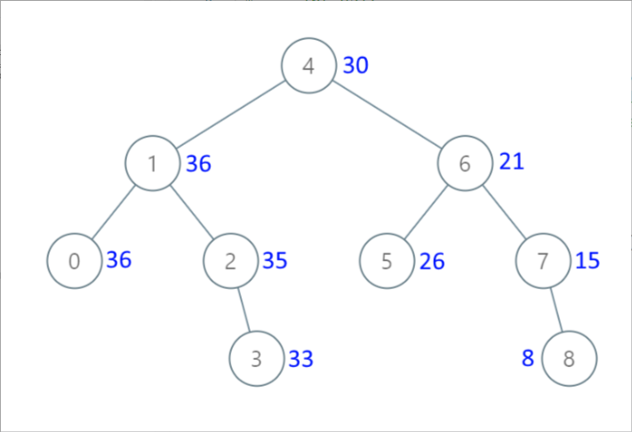

题目链接：[538-把二叉搜索树转换为累加树](https://leetcode-cn.com/problems/convert-bst-to-greater-tree/)

难度：<font color="Orange">中等</font>

题目内容：

给出二叉 搜索 树的根节点，该树的节点值各不相同，请你将其转换为累加树（Greater Sum Tree），使每个节点 node 的新值等于原树中大于或等于 node.val 的值之和。<br>
提醒一下，二叉搜索树满足下列约束条件：<br>
节点的左子树仅包含键 小于 节点键的节点。<br>
节点的右子树仅包含键 大于 节点键的节点。<br>
左右子树也必须是二叉搜索树。

示例 1：<br>
<br>
输入：[4,1,6,0,2,5,7,null,null,null,3,null,null,null,8]<br>
输出：[30,36,21,36,35,26,15,null,null,null,33,null,null,null,8]

示例 2：<br>
输入：root = [0,null,1]<br>
输出：[1,null,1]

示例 3：<br>
输入：root = [1,0,2]<br>
输出：[3,3,2]

示例 4：<br>
输入：root = [3,2,4,1]<br>
输出：[7,9,4,10]

提示：<br>
树中的节点数介于 0 和 10^4 之间。<br>
每个节点的值介于 -10^4 和 10^4 之间。<br>
树中的所有值 互不相同 。<br>
给定的树为二叉搜索树。


代码：
```
/**
 * Definition for a binary tree node.
 * struct TreeNode {
 *     int val;
 *     TreeNode *left;
 *     TreeNode *right;
 *     TreeNode() : val(0), left(nullptr), right(nullptr) {}
 *     TreeNode(int x) : val(x), left(nullptr), right(nullptr) {}
 *     TreeNode(int x, TreeNode *left, TreeNode *right) : val(x), left(left), right(right) {}
 * };
 */

// 递归，由于是倒序加和，顺序为反中序遍历
class Solution {
public:
    int pre = 0;
    TreeNode* convertBST(TreeNode* root) {
        if (root) {
            if (root->right)
                convertBST(root->right);
            root->val += pre;
            pre = root->val;
            if (root->left)
                convertBST(root->left);
        }
        return root;
    }
};

// 迭代，顺序为反中序遍历
class Solution {
public:
    TreeNode* convertBST(TreeNode* root) {
        if (root) {
            int pre = 0;
            stack<TreeNode*> s;
            s.push(root);
            while (!s.empty()) {
                TreeNode* temp = s.top();
                if (temp) {
                    s.pop();
                    if (temp->left)
                        s.push(temp->left);
                    s.push(temp);
                    s.push(nullptr);
                    if (temp->right)
                        s.push(temp->right);
                }
                else {
                    s.pop();
                    s.top()->val += pre;
                    pre = s.top()->val;
                    s.pop();
                }
            }
        }
        return root;
    }
};
```