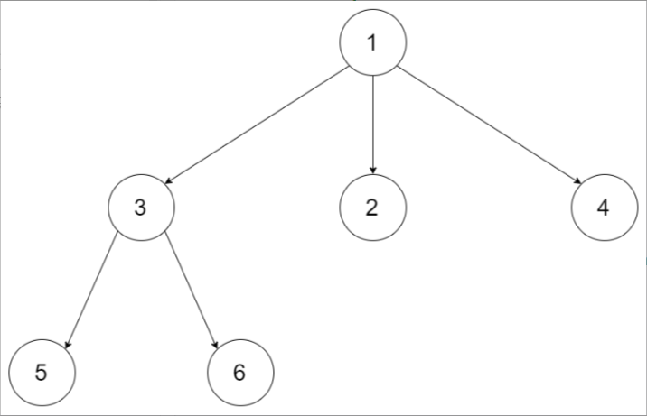
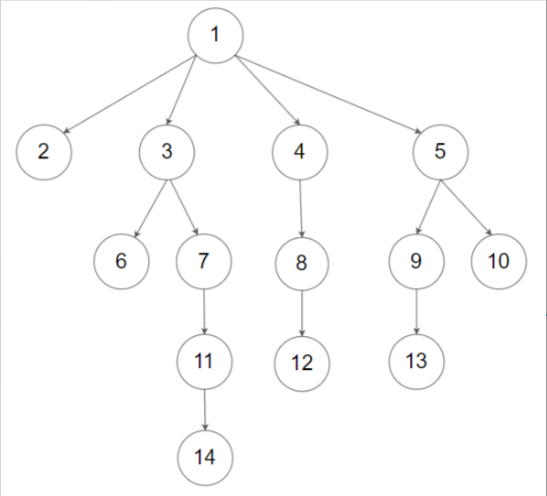

题目链接：[559-N叉树的最大深度](https://leetcode-cn.com/problems/maximum-depth-of-n-ary-tree/)

难度：<font color="Green">简单</font>

题目内容：

给定一个 N 叉树，找到其最大深度。<br>
最大深度是指从根节点到最远叶子节点的最长路径上的节点总数。<br>
N 叉树输入按层序遍历序列化表示，每组子节点由空值分隔（请参见示例）。

示例 1：<br>
<br>
输入：root = [1,null,3,2,4,null,5,6]<br>
输出：3

示例 2：<br>
<br>
输入：root = [1,null,2,3,4,5,null,null,6,7,null,8,null,9,10,null,null,11,null,12,null,13,null,null,14]<br>
输出：5

提示：<br>
树的深度不会超过 1000 。<br>
树的节点数目位于 [0, 10^4] 之间。


代码：
```
/*
// Definition for a Node.
class Node {
public:
    int val;
    vector<Node*> children;

    Node() {}

    Node(int _val) {
        val = _val;
    }

    Node(int _val, vector<Node*> _children) {
        val = _val;
        children = _children;
    }
};
*/

// 递归，利用后序遍历求根节点高度
class Solution {
public:
    int maxDepth(Node* root) {
        if (!root)
            return 0;
        int ans = 0;
        for (auto child: root->children)
            ans = max(ans, maxDepth(child));
        return ans + 1;
    }
};

// 迭代，利用层序遍历
class Solution {
public:
    int maxDepth(Node* root) {
        int ans = 0;
        if (root) {
            queue<Node*> q;
            q.push(root);
            while (!q.empty()) {
                int len = q.size();
                while (len--) {
                    Node* temp = q.front();
                    for (auto child: temp->children)
                        q.push(child);
                    q.pop();
                }
                ++ans;
            }
        }
        return ans;
    }
};
```