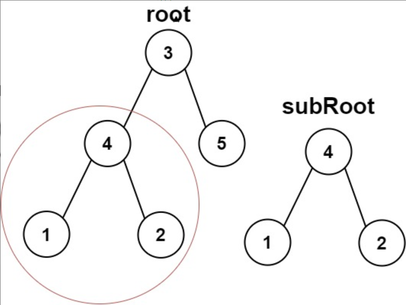
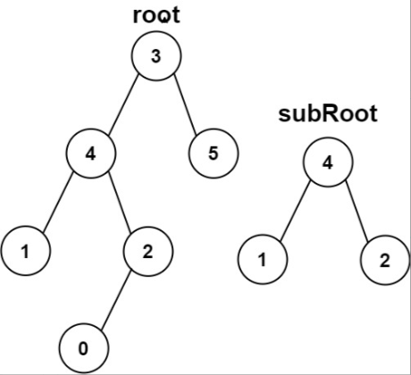

题目链接：[572-另一棵树的子树](https://leetcode-cn.com/problems/subtree-of-another-tree/)

难度：<font color="Green">简单</font>

题目内容：

给你两棵二叉树 root 和 subRoot 。检验 root 中是否包含和 subRoot 具有相同结构和节点值的子树。如果存在，返回 true ；否则，返回 false 。<br>
二叉树 tree 的一棵子树包括 tree 的某个节点和这个节点的所有后代节点。tree 也可以看做它自身的一棵子树。

示例 1：<br>
<br>
输入：root = [3,4,5,1,2], subRoot = [4,1,2]<br>
输出：true

示例 2：<br>
<br>
输入：root = [3,4,5,1,2,null,null,null,null,0], subRoot = [4,1,2]<br>
输出：false

提示：<br>
root 树上的节点数量范围是 [1, 2000]<br>
subRoot 树上的节点数量范围是 [1, 1000]<br>
-10^4 <= root.val <= 10^4<br>
-10^4 <= subRoot.val <= 10^4


代码：
```
/**
 * Definition for a binary tree node.
 * struct TreeNode {
 *     int val;
 *     TreeNode *left;
 *     TreeNode *right;
 *     TreeNode() : val(0), left(nullptr), right(nullptr) {}
 *     TreeNode(int x) : val(x), left(nullptr), right(nullptr) {}
 *     TreeNode(int x, TreeNode *left, TreeNode *right) : val(x), left(left), right(right) {}
 * };
 */
class Solution {
public:
    bool isSameTree(TreeNode* p, TreeNode* q) {
        if (!p && !q)
            return true;
        else if (!(p && q))
            return false;
        else if (p->val != q->val)
            return false;
        else
            return isSameTree(p->left, q->left) && isSameTree(p->right, q->right);
    }
    
    bool isSubtree(TreeNode* root, TreeNode* subRoot) {
        if (!subRoot)
            return true;
        if (!root)
            return false;
        if (isSameTree(root, subRoot))
            return true;
        return isSubtree(root->left, subRoot) || isSubtree(root->right, subRoot);
    }
};
```