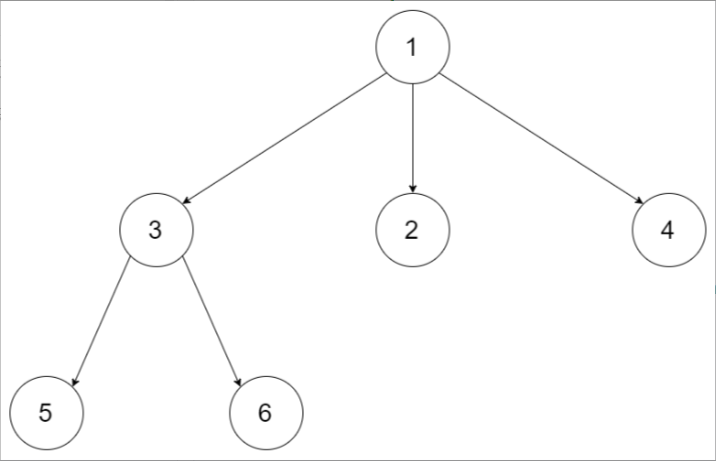
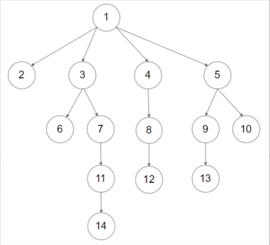

题目链接：[590-N叉树的后序遍历](https://leetcode-cn.com/problems/n-ary-tree-postorder-traversal/)

难度：<font color="Green">简单</font>

题目内容：

给定一个 n 叉树的根节点  root ，返回 其节点值的 后序遍历 。<br>
n 叉树 在输入中按层序遍历进行序列化表示，每组子节点由空值 null 分隔（请参见示例）。

示例 1：<br>
<br>
输入：root = [1,null,3,2,4,null,5,6]<br>
输出：[5,6,3,2,4,1]

示例 2：<br>
<br>
输入：root = [1,null,2,3,4,5,null,null,6,7,null,8,null,9,10,null,null,11,null,12,null,13,null,null,14]<br>
输出：[2,6,14,11,7,3,12,8,4,13,9,10,5,1]

提示：<br>
节点总数在范围 [0, 10^4]内<br>
0 <= Node.val <= 10^4<br>
n 叉树的高度小于或等于 1000

进阶：递归法很简单，你可以使用迭代法完成此题吗?


代码：
```
/*
// Definition for a Node.
class Node {
public:
    int val;
    vector<Node*> children;

    Node() {}

    Node(int _val) {
        val = _val;
    }

    Node(int _val, vector<Node*> _children) {
        val = _val;
        children = _children;
    }
};
*/

// 递归
class Solution {
public:
    vector<int> ans;
    vector<int> postorder(Node* root) {
        if (root) {
            for (auto child: root->children)
                postorder(child);
            ans.push_back(root->val);
        }
        return ans;
    }
};

// 迭代
class Solution {
public:
    vector<int> postorder(Node* root) {
        vector<int> ans;
        if (root) {
            stack<Node*> s;
            s.push(root);
            while (!s.empty()) {
                Node* temp = s.top();
                if (temp) {
                    s.push(nullptr);
                    int len = temp->children.size();
                    for (int i = len - 1; i >= 0; --i)
                        s.push(temp->children[i]);
                }
                else {
                    s.pop();
                    ans.push_back(s.top()->val);
                    s.pop();
                }
            }
        }
        return ans;
    }
};
```