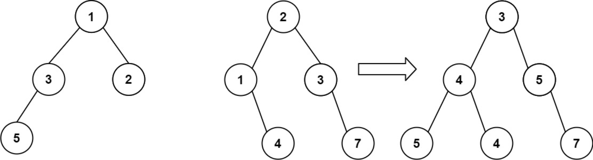

题目链接：[617-合并二叉树](https://leetcode-cn.com/problems/merge-two-binary-trees/)

难度：<font color="Green">简单</font>

题目内容：

给你两棵二叉树： root1 和 root2 。<br>
想象一下，当你将其中一棵覆盖到另一棵之上时，两棵树上的一些节点将会重叠（而另一些不会）。你需要将这两棵树合并成一棵新二叉树。合并的规则是：如果两个节点重叠，那么将这两个节点的值相加作为合并后节点的新值；否则，不为 null 的节点将直接作为新二叉树的节点。<br>
返回合并后的二叉树。<br>

注意: 合并过程必须从两个树的根节点开始。

示例 1：<br>
<br>
输入：root1 = [1,3,2,5], root2 = [2,1,3,null,4,null,7]<br>
输出：[3,4,5,5,4,null,7]

示例 2：<br>
输入：root1 = [1], root2 = [1,2]<br>
输出：[2,2]

提示：<br>
两棵树中的节点数目在范围 [0, 2000] 内<br>
-10^4 <= Node.val <= 10^4


代码：
```
/**
 * Definition for a binary tree node.
 * struct TreeNode {
 *     int val;
 *     TreeNode *left;
 *     TreeNode *right;
 *     TreeNode() : val(0), left(nullptr), right(nullptr) {}
 *     TreeNode(int x) : val(x), left(nullptr), right(nullptr) {}
 *     TreeNode(int x, TreeNode *left, TreeNode *right) : val(x), left(left), right(right) {}
 * };
 */

// 递归，前序遍历
class Solution {
public:
    TreeNode* mergeTrees(TreeNode* root1, TreeNode* root2) {
        if (!root1)
            return root2;
        if (!root2)
            return root1;
        TreeNode* ans = new TreeNode(root1->val + root2->val);
        ans->left = mergeTrees(root1->left, root2->left);
        ans->right = mergeTrees(root1->right, root2->right);
        return ans;
    }
};

// 迭代（利用队列）
class Solution {
public:
    TreeNode* mergeTrees(TreeNode* root1, TreeNode* root2) {
        if (!root1)
            return root2;
        if (!root2)
            return root1;
        queue<TreeNode*> q;
        q.push(root1);
        q.push(root2);
        while (!q.empty()) {
            TreeNode* node1 = q.front();
            q.pop();
            TreeNode* node2 = q.front();
            q.pop();
            if (node1 && node2) {
                node1->val += node2->val;
                if (node1->left && node2->left) {
                    q.push(node1->left);
                    q.push(node2->left);
                }
                if (node1->right && node2->right) {
                    q.push(node1->right);
                    q.push(node2->right);
                }
                if (!node1->left)
                    node1->left = node2->left;
                if (!node1->right)
                    node1->right = node2->right;
            }
        }
        return root1;
    }
};

// 迭代（利用栈）
class Solution {
public:
    TreeNode* mergeTrees(TreeNode* root1, TreeNode* root2) {
        if (!root1)
            return root2;
        if (!root2)
            return root1;
        stack<TreeNode*> s;
        s.push(root2);
        s.push(root1);
        while (!s.empty()) {
            TreeNode* node1 = s.top();
            s.pop();
            TreeNode* node2 = s.top();
            s.pop();
            if (node1 && node2) {
                node1->val += node2->val;
                if (node1->right && node2->right) {
                    s.push(node2->right);
                    s.push(node1->right);
                }
                if (node1->left && node2->left) {
                    s.push(node2->left);
                    s.push(node1->left);
                }
                if (!node1->right)
                    node1->right = node2->right;
                if (!node1->left)
                    node1->left = node2->left;
            }
        }
        return root1;
    }
};
```