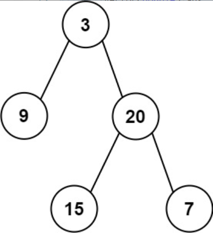
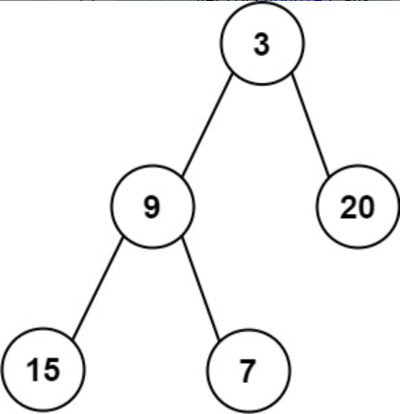

题目链接：[637-二叉树的层平均值](https://leetcode-cn.com/problems/average-of-levels-in-binary-tree/)

难度：<font color="Green">简单</font>

题目内容：

给定一个非空二叉树的根节点 root , 以数组的形式返回每一层节点的平均值。与实际答案相差 10^-5 以内的答案可以被接受。

示例 1：<br>
<br>
输入：root = [3,9,20,null,null,15,7]<br>
输出：[3.00000,14.50000,11.00000]<br>
解释：第 0 层的平均值为 3,第 1 层的平均值为 14.5,第 2 层的平均值为 11 。<br>
因此返回 [3, 14.5, 11] 。

示例 2:<br>
<br>
输入：root = [3,9,20,15,7]<br>
输出：[3.00000,14.50000,11.00000]

提示：<br>
树中节点数量在 [1, 10^4] 范围内<br>
-2^31 <= Node.val <= 2^31 - 1


代码：
```
/**
 * Definition for a binary tree node.
 * struct TreeNode {
 *     int val;
 *     TreeNode *left;
 *     TreeNode *right;
 *     TreeNode() : val(0), left(nullptr), right(nullptr) {}
 *     TreeNode(int x) : val(x), left(nullptr), right(nullptr) {}
 *     TreeNode(int x, TreeNode *left, TreeNode *right) : val(x), left(left), right(right) {}
 * };
 */
class Solution {
public:
    vector<double> averageOfLevels(TreeNode* root) {
        vector<double> ans;
        if (root) {
            queue<TreeNode*> q;
            q.push(root);
            while (!q.empty()) {
                int len = q.size();
                double sum = 0;
                for (int i = 0; i < len; ++i) {
                    TreeNode* temp = q.front();
                    sum += temp->val;
                    if (temp->left)
                        q.push(temp->left);
                    if (temp->right)
                        q.push(temp->right);
                    q.pop();
                }
                ans.push_back(sum / len);
            }
        }
        return ans;
    }
};
```