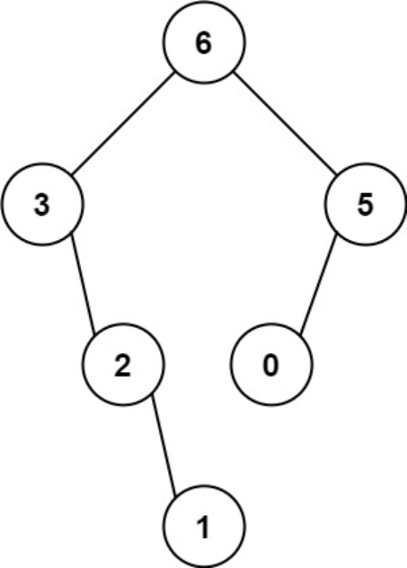
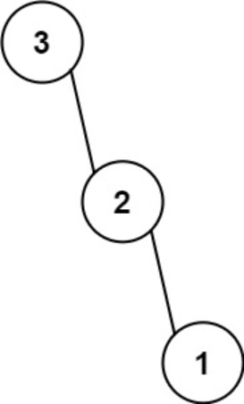

题目链接：[654-最大二叉树](https://leetcode-cn.com/problems/maximum-binary-tree/)

难度：<font color="Orange">中等</font>

题目内容：

给定一个不重复的整数数组 nums 。 最大二叉树 可以用下面的算法从 nums 递归地构建:<br>
创建一个根节点，其值为 nums 中的最大值。<br>
递归地在最大值 左边 的 子数组前缀上 构建左子树。<br>
递归地在最大值 右边 的 子数组后缀上 构建右子树。<br>
返回 nums 构建的 最大二叉树 。

示例 1：<br>
<br>
输入：nums = [3,2,1,6,0,5]<br>
输出：[6,3,5,null,2,0,null,null,1]<br>
解释：递归调用如下所示：
- [3,2,1,6,0,5] 中的最大值是 6 ，左边部分是 [3,2,1] ，右边部分是 [0,5] 。
    - [3,2,1] 中的最大值是 3 ，左边部分是 [] ，右边部分是 [2,1] 。
        - 空数组，无子节点。
        - [2,1] 中的最大值是 2 ，左边部分是 [] ，右边部分是 [1] 。
            - 空数组，无子节点。
            - 只有一个元素，所以子节点是一个值为 1 的节点。
    - [0,5] 中的最大值是 5 ，左边部分是 [0] ，右边部分是 [] 。
        - 只有一个元素，所以子节点是一个值为 0 的节点。
        - 空数组，无子节点。

示例 2：<br>
<br>
输入：nums = [3,2,1]<br>
输出：[3,null,2,null,1]

提示：<br>
1 <= nums.length <= 1000<br>
0 <= nums[i] <= 1000<br>
nums 中的所有整数 互不相同


代码：
```
/**
 * Definition for a binary tree node.
 * struct TreeNode {
 *     int val;
 *     TreeNode *left;
 *     TreeNode *right;
 *     TreeNode() : val(0), left(nullptr), right(nullptr) {}
 *     TreeNode(int x) : val(x), left(nullptr), right(nullptr) {}
 *     TreeNode(int x, TreeNode *left, TreeNode *right) : val(x), left(left), right(right) {}
 * };
 */

// 递归，思路类似前中/中后序构造二叉树
class Solution {
public:
    TreeNode* constructMaximumBinaryTree(vector<int>& nums) {
        if (nums.empty())
            return nullptr;
        auto pos = max_element(nums.begin(), nums.end());
        TreeNode* ans = new TreeNode(*pos);
        vector<int> lv(nums.begin(), pos);
        vector<int> rv(pos + 1, nums.end());
        ans->left = constructMaximumBinaryTree(lv);
        ans->right = constructMaximumBinaryTree(rv);
        return ans;
    }
};

// 递归，由于构造向量效率不高，因此考虑利用下标分割向量，只是此时需要仔细计算
class Solution {
public:
    TreeNode* construct(vector<int>& nums, int start, int finish) {
        if (start > finish)
            return nullptr;
        auto pos = max_element(nums.begin() + start, nums.begin() + finish + 1);
        TreeNode* ans = new TreeNode(*pos);
        int left_start = start;
        int left_finish = pos - nums.begin() - 1;
        int right_start = left_finish + 2;
        int right_finish = finish;
        ans->left = construct(nums, left_start, left_finish);
        ans->right = construct(nums, right_start, right_finish);
        return ans;
    }
    TreeNode* constructMaximumBinaryTree(vector<int>& nums) {
        return construct(nums, 0, nums.size() - 1);
    }
};
```