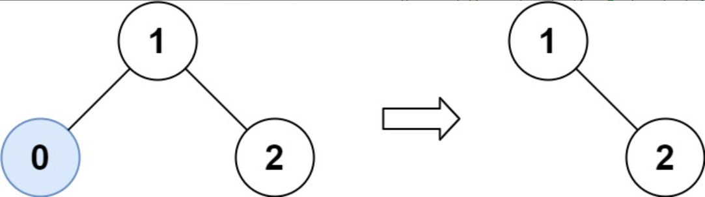
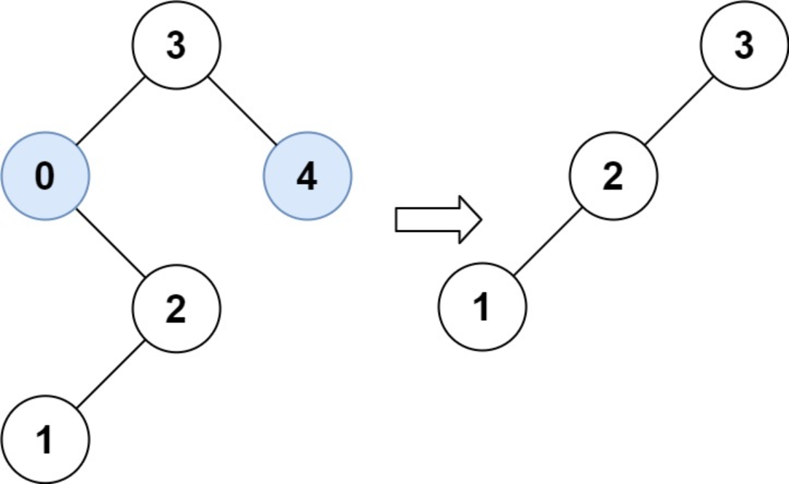

题目链接：[669-修剪二叉搜索树](https://leetcode-cn.com/problems/trim-a-binary-search-tree/)

难度：<font color="Orange">中等</font>

题目内容：

给你二叉搜索树的根节点 root ，同时给定最小边界low 和最大边界 high。通过修剪二叉搜索树，使得所有节点的值在[low, high]中。修剪树 不应该 改变保留在树中的元素的相对结构 (即，如果没有被移除，原有的父代子代关系都应当保留)。 可以证明，存在 唯一的答案 。<br>
所以结果应当返回修剪好的二叉搜索树的新的根节点。注意，根节点可能会根据给定的边界发生改变。

示例 1：<br>
<br>
输入：root = [1,0,2], low = 1, high = 2<br>
输出：[1,null,2]

示例 2：<br>
<br>
输入：root = [3,0,4,null,2,null,null,1], low = 1, high = 3<br>
输出：[3,2,null,1]

提示：<br>
树中节点数在范围 [1, 10^4] 内<br>
0 <= Node.val <= 10^4<br>
树中每个节点的值都是 唯一 的<br>
题目数据保证输入是一棵有效的二叉搜索树<br>
0 <= low <= high <= 10^4


代码：
```
/**
 * Definition for a binary tree node.
 * struct TreeNode {
 *     int val;
 *     TreeNode *left;
 *     TreeNode *right;
 *     TreeNode() : val(0), left(nullptr), right(nullptr) {}
 *     TreeNode(int x) : val(x), left(nullptr), right(nullptr) {}
 *     TreeNode(int x, TreeNode *left, TreeNode *right) : val(x), left(left), right(right) {}
 * };
 */

// 递归，需要结合二叉搜索树理解
// 某节点值比下边界小时则修剪后为右子树的修剪效果，比上边界大时则修剪后为左子树的修剪效果
class Solution {
public:
    TreeNode* trimBST(TreeNode* root, int low, int high) {
        if (!root)
            return nullptr;
        if (root->val > high)
            return trimBST(root->left, low, high);
        if (root->val < low)
            return trimBST(root->right, low, high);
        root->left = trimBST(root->left, low, high);
        root->right = trimBST(root->right, low, high);
        return root;
    }
};

// 迭代，思路与递归类似，可以通过画图加深理解
class Solution {
public:
    TreeNode* trimBST(TreeNode* root, int low, int high) {
        if (root) {
            while (root && (root->val > high || root->val < low)) {
                if (root->val > high)
                    root = root->left;
                else
                    root = root->right;
            }
            TreeNode* temp = root;
            while (temp) {
                while (temp->left && temp->left->val < low) {
                    temp->left = temp->left->right;
                }
                temp = temp->left;
            } 
            temp = root;
            while (temp) {
                while (temp->right && temp->right->val > high) {
                    temp->right = temp->right->left;
                }
                temp = temp->right;
            }
        }
        return root;
    }
};
```