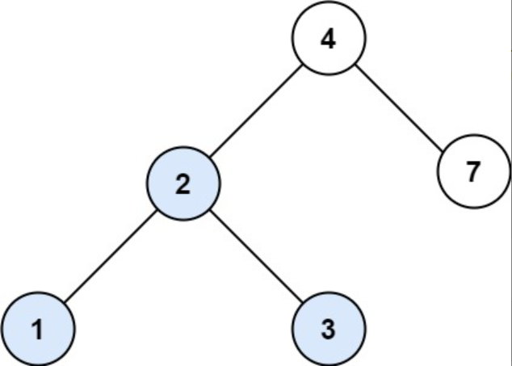
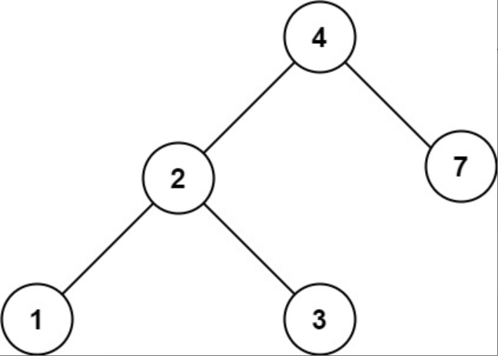

题目链接：[700-二叉搜索树中的搜索](https://leetcode-cn.com/problems/search-in-a-binary-search-tree/)

难度：<font color="Green">简单</font>

题目内容：

给定二叉搜索树（BST）的根节点 root 和一个整数值 val。<br>
你需要在 BST 中找到节点值等于 val 的节点。 返回以该节点为根的子树。 如果节点不存在，则返回 null 。

示例 1:<br>
<br>
输入：root = [4,2,7,1,3], val = 2<br>
输出：[2,1,3]

示例 2:<br>
<br>
输入：root = [4,2,7,1,3], val = 5<br>
输出：[]

提示：<br>
数中节点数在 [1, 5000] 范围内<br>
1 <= Node.val <= 10^7<br>
root 是二叉搜索树<br>
1 <= val <= 10^7


代码：
```
/**
 * Definition for a binary tree node.
 * struct TreeNode {
 *     int val;
 *     TreeNode *left;
 *     TreeNode *right;
 *     TreeNode() : val(0), left(nullptr), right(nullptr) {}
 *     TreeNode(int x) : val(x), left(nullptr), right(nullptr) {}
 *     TreeNode(int x, TreeNode *left, TreeNode *right) : val(x), left(left), right(right) {}
 * };
 */

// 递归
class Solution {
public:
    TreeNode* searchBST(TreeNode* root, int val) {
        if (!root || root->val == val)
            return root;
        if (root->val > val)
            return searchBST(root->left, val);
        return searchBST(root->right, val);
    }
};

// 迭代
class Solution {
public:
    TreeNode* searchBST(TreeNode* root, int val) {
        if (root) {
            TreeNode* ans = root;
            while (ans) {
                if (ans->val == val)
                    return ans;
                if (ans->val > val)
                    ans = ans->left;
                else if (ans->val < val)
                    ans = ans->right;
            }
        }
        return nullptr;
    }
};
```