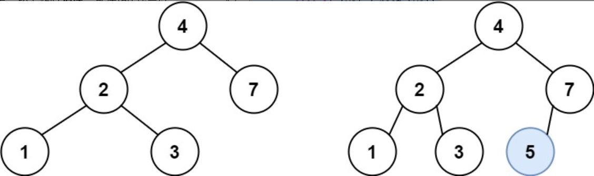
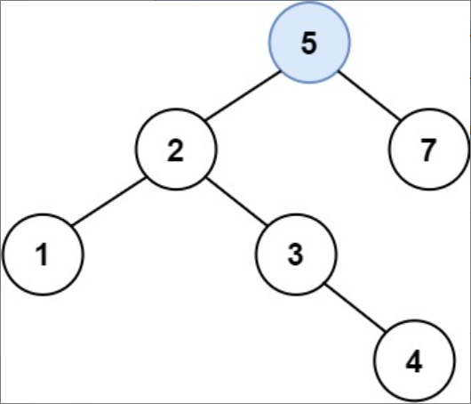

题目链接：[701-二叉搜索树中的插入操作](https://leetcode-cn.com/problems/insert-into-a-binary-search-tree/)

难度：<font color="Orange">中等</font>

题目内容：

给定二叉搜索树（BST）的根节点 root 和要插入树中的值 value ，将值插入二叉搜索树。 返回插入后二叉搜索树的根节点。 输入数据 保证 ，新值和原始二叉搜索树中的任意节点值都不同。<br>
注意，可能存在多种有效的插入方式，只要树在插入后仍保持为二叉搜索树即可。 你可以返回 任意有效的结果 。

示例 1：<br>
<br>
输入：root = [4,2,7,1,3], val = 5<br>
输出：[4,2,7,1,3,5]<br>
解释：另一个满足题目要求可以通过的树是：<br>


示例 2：<br>
输入：root = [40,20,60,10,30,50,70], val = 25<br>
输出：[40,20,60,10,30,50,70,null,null,25]

示例 3：<br>
输入：root = [4,2,7,1,3,null,null,null,null,null,null], val = 5<br>
输出：[4,2,7,1,3,5]
 

提示：<br>
树中的节点数将在 [0, 10^4]的范围内。<br>
-10^8 <= Node.val <= 10^8<br>
所有值 Node.val 是 独一无二 的。<br>
-10^8 <= val <= 10^8<br>
保证 val 在原始BST中不存在。


代码：
```
/**
 * Definition for a binary tree node.
 * struct TreeNode {
 *     int val;
 *     TreeNode *left;
 *     TreeNode *right;
 *     TreeNode() : val(0), left(nullptr), right(nullptr) {}
 *     TreeNode(int x) : val(x), left(nullptr), right(nullptr) {}
 *     TreeNode(int x, TreeNode *left, TreeNode *right) : val(x), left(left), right(right) {}
 * };
 */

// 递归
class Solution {
public:
    TreeNode* insertIntoBST(TreeNode* root, int val) {
        if (!root)
            root = new TreeNode(val);
        else if (val < root->val)
            root->left = insertIntoBST(root->left, val);
        else if (val > root->val)
            root->right = insertIntoBST(root->right, val);
        return root;
    }
};

// 迭代
class Solution {
public:
    TreeNode* insertIntoBST(TreeNode* root, int val) {
        if (!root)
            return new TreeNode(val);
        TreeNode* temp = root;
        TreeNode* parent = root;
        while (temp) {
            parent = temp;
            if (temp->val > val) 
                temp = temp->left;
            else if (temp->val < val)
                temp = temp->right;
        }
        if (parent->val > val)
            parent->left = new TreeNode(val);
        else if (parent->val < val)
            parent->right = new TreeNode(val);
        return root;
    }
};
```