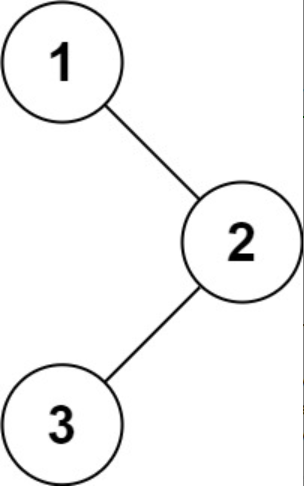

题目链接：[94-二叉树的中序遍历](https://leetcode-cn.com/problems/binary-tree-inorder-traversal/)

难度：<font color="Green">简单</font>

题目内容：

给定一个二叉树的根节点 root ，返回 它的 中序 遍历 。

示例 1：<br>
<br>
输入：root = [1,null,2,3]<br>
输出：[1,3,2]

示例 2：<br>
输入：root = []<br>
输出：[]

示例 3：<br>
输入：root = [1]<br>
输出：[1]

提示：<br>
树中节点数目在范围 [0, 100] 内<br>
-100 <= Node.val <= 100<br>

进阶: 递归算法很简单，你可以通过迭代算法完成吗？


代码：
```
/**
 * Definition for a binary tree node.
 * struct TreeNode {
 *     int val;
 *     TreeNode *left;
 *     TreeNode *right;
 *     TreeNode() : val(0), left(nullptr), right(nullptr) {}
 *     TreeNode(int x) : val(x), left(nullptr), right(nullptr) {}
 *     TreeNode(int x, TreeNode *left, TreeNode *right) : val(x), left(left), right(right) {}
 * };
 */

// 递归
class Solution {
public:
    vector<int> ans;
    vector<int> inorderTraversal(TreeNode* root) {
        if (root) {
            inorderTraversal(root->left);
            ans.push_back(root->val);
            inorderTraversal(root->right);
        }
        return ans;
    }
};

// 迭代，利用栈，由于处理顺序与访问顺序不同，因此通过指针遍历访问树节点，通过栈处理节点
class Solution {
public:
    vector<int> inorderTraversal(TreeNode* root) {
        vector<int> ans;
        if (root) {
            stack<TreeNode*> s;
            TreeNode* temp = root;
            while (temp || !s.empty()) {
                if (temp) {
                    s.push(temp);
                    temp = temp->left;
                }
                else {
                    temp = s.top();
                    ans.push_back(temp->val);
                    s.pop();
                    temp = temp->right;
                }
            }
        }
        return ans;
    }
};

// 迭代（统一风格），标记法
class Solution {
public:
    vector<int> inorderTraversal(TreeNode* root) {
        vector<int> ans;
        if (root) {
            stack<TreeNode*> s;
            s.push(root);
            while (!s.empty()) {
                TreeNode* temp = s.top();
                if (temp) {
                    s.pop();
                    if (temp->right)
                        s.push(temp->right);
                    s.push(temp);
                    s.push(nullptr);
                    if (temp->left)
                        s.push(temp->left);
                }
                else {
                    s.pop();
                    ans.push_back(s.top()->val);
                    s.pop();
                }
            }
        }
        return ans;
    }
};
```