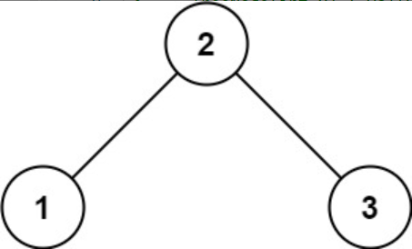
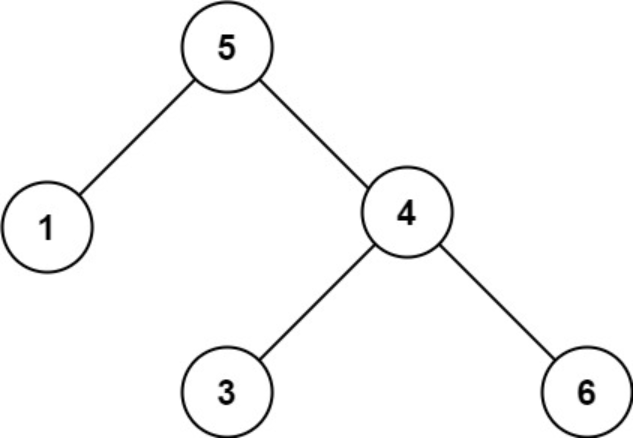

题目链接：[98-验证二叉搜索树](https://leetcode-cn.com/problems/validate-binary-search-tree/)

难度：<font color="Orange">中等</font>

题目内容：

给你一个二叉树的根节点 root ，判断其是否是一个有效的二叉搜索树。<br>
有效 二叉搜索树定义如下：<br>
节点的左子树只包含 小于 当前节点的数。<br>
节点的右子树只包含 大于 当前节点的数。<br>
所有左子树和右子树自身必须也是二叉搜索树。

示例 1：<br>
<br>
输入：root = [2,1,3]<br>
输出：true

示例 2：<br>
<br>
输入：root = [5,1,4,null,null,3,6]<br>
输出：false<br>
解释：根节点的值是 5 ，但是右子节点的值是 4 。

提示：<br>
树中节点数目范围在[1, 10^4] 内<br>
-2^31 <= Node.val <= 2^31 - 1


代码：
```
/**
 * Definition for a binary tree node.
 * struct TreeNode {
 *     int val;
 *     TreeNode *left;
 *     TreeNode *right;
 *     TreeNode() : val(0), left(nullptr), right(nullptr) {}
 *     TreeNode(int x) : val(x), left(nullptr), right(nullptr) {}
 *     TreeNode(int x, TreeNode *left, TreeNode *right) : val(x), left(left), right(right) {}
 * };
 */

// 递归，中序遍历转化成数组，判断是否递增
class Solution {
public:
    void inorder(TreeNode* root, vector<int>& order) {
        if (root) {
            inorder(root->left, order);
            order.push_back(root->val);
            inorder(root->right, order);
        }
    }

    bool isValidBST(TreeNode* root) {
        if (!root)
            return true;
        vector<int> order;
        inorder(root, order);
        int len = order.size();
        for (int i = 0; i < len - 1; ++i) {
            if (order[i] >= order[i + 1])
                return false;
        }
        return true;
    }
};

// 递归，在中序遍历过程中比较，无需建立数组
class Solution {
public:
    long long flag = LLONG_MIN;
    bool isValidBST(TreeNode* root) {
        if (!root)
            return true;
        bool left_valid = isValidBST(root->left);
        if (flag >= root->val)
            return false;
        flag = root->val;
        bool right_valid = isValidBST(root->right);
        return left_valid && right_valid;
    }
};

// 迭代，中序遍历转化成数组，判断是否递增
class Solution {
public:
    void inorder(TreeNode* root, vector<int>& order) {
        if (root) {
            stack<TreeNode*> s;
            s.push(root);
            while (!s.empty()) {
                TreeNode* temp = s.top();
                if (temp) {
                    s.pop();
                    if (temp->right)
                        s.push(temp->right);
                    s.push(temp);
                    s.push(nullptr);
                    if (temp->left)
                        s.push(temp->left);
                }
                else {
                    s.pop();
                    order.push_back(s.top()->val);
                    s.pop();
                }
            }
        }
    }

    bool isValidBST(TreeNode* root) {
        if (!root)
            return true;
        vector<int> order;
        inorder(root, order);
        int len = order.size();
        for (int i = 0; i < len - 1; ++i) {
            if (order[i] >= order[i + 1])
                return false;
        }
        return true;
    }
};

// 迭代，在中序遍历过程中比较，无需建立数组
class Solution {
public:
    long long flag = LLONG_MIN;
    bool isValidBST(TreeNode* root) {
        if (root) {
            stack<TreeNode*> s;
            s.push(root);
            while (!s.empty()) {
                TreeNode* temp = s.top();
                if (temp) {
                    s.pop();
                    if (temp->right)
                        s.push(temp->right);
                    s.push(temp);
                    s.push(nullptr);
                    if (temp->left)
                        s.push(temp->left);
                }
                else {
                    s.pop();
                    if (flag >= s.top()->val)
                        return false;
                    flag = s.top()->val;
                    s.pop();
                }
            }
        }
        return true;
    }
};
```