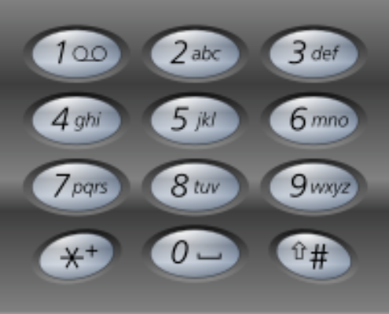

题目链接：[17-电话号码的字母组合](https://leetcode-cn.com/problems/letter-combinations-of-a-phone-number/)

难度：<font color="Orange">中等</font>

题目内容：

给定一个仅包含数字 2-9 的字符串，返回所有它能表示的字母组合。答案可以按 任意顺序 返回。<br>
给出数字到字母的映射如下（与电话按键相同）。注意 1 不对应任何字母。<br>


示例 1：<br>
输入：digits = "23"<br>
输出：["ad","ae","af","bd","be","bf","cd","ce","cf"]

示例 2：<br>
输入：digits = ""<br>
输出：[]

示例 3：<br>
输入：digits = "2"<br>
输出：["a","b","c"]

提示：<br>
0 <= digits.length <= 4<br>
digits[i] 是范围 ['2', '9'] 的一个数字。


代码：
```
class Solution {
public:
    string dict[8] = {"abc", "def", "ghi", "jkl", "mno", "pqrs", "tuv", "wxyz"};
    void dfs(string digits, int pos, string path, vector<string>& ans) {
        if (pos == digits.length()) {
            ans.push_back(path);
            return ;
        }
        for (auto c: dict[digits[pos] - '2'])
            // 注意，回溯隐藏在了递归函数中
            dfs(digits, pos + 1, path + c, ans);
    }

    vector<string> letterCombinations(string digits) {
        vector<string> ans;
        if (!digits.empty()) {
            string path;
            dfs(digits, 0, path, ans);
        }
        return ans;
    }
};
```