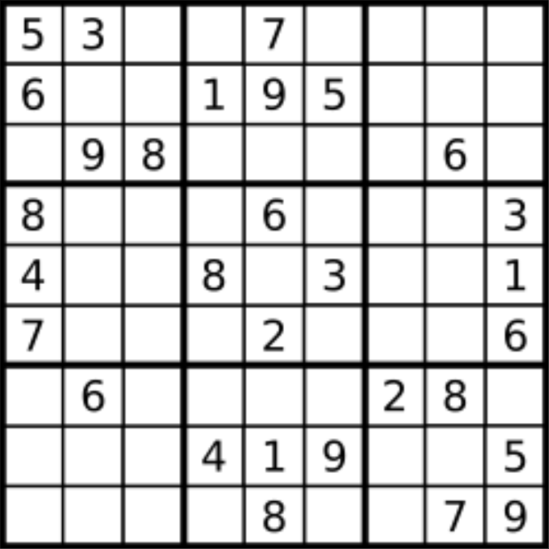

题目链接：[37-解数独](https://leetcode-cn.com/problems/sudoku-solver/)

难度：<font color="Red">困难</font>

题目内容：

编写一个程序，通过填充空格来解决数独问题。<br>
数独的解法需 遵循如下规则：<br>
数字 1-9 在每一行只能出现一次。<br>
数字 1-9 在每一列只能出现一次。<br>
数字 1-9 在每一个以粗实线分隔的 3x3 宫内只能出现一次。（请参考示例图）<br>
数独部分空格内已填入了数字，空白格用 '.' 表示。

示例 1：<br>

```
输入：
board = [["5","3",".",".","7",".",".",".","."],
         ["6",".",".","1","9","5",".",".","."],
         [".","9","8",".",".",".",".","6","."],
         ["8",".",".",".","6",".",".",".","3"],
         ["4",".",".","8",".","3",".",".","1"],
         ["7",".",".",".","2",".",".",".","6"],
         [".","6",".",".",".",".","2","8","."],
         [".",".",".","4","1","9",".",".","5"],
         [".",".",".",".","8",".",".","7","9"]]
输出：
        [["5","3","4","6","7","8","9","1","2"],
         ["6","7","2","1","9","5","3","4","8"],
         ["1","9","8","3","4","2","5","6","7"],
         ["8","5","9","7","6","1","4","2","3"],
         ["4","2","6","8","5","3","7","9","1"],
         ["7","1","3","9","2","4","8","5","6"],
         ["9","6","1","5","3","7","2","8","4"],
         ["2","8","7","4","1","9","6","3","5"],
         ["3","4","5","2","8","6","1","7","9"]]
```
解释：输入的数独如上图所示，唯一有效的解决方案如下所示：<br>


提示：<br>
board.length == 9<br>
board[i].length == 9<br>
board[i][j] 是一位数字或者 '.'<br>
题目数据 保证 输入数独仅有一个解


代码：
```
// 本题是二维递归，观察逻辑可以得知，不需要终止条件，也不会出现死循环的情况
// 但可能会有些难理解，建议借助回溯树理解
class Solution {
public:
    bool check(vector<vector<char>>& board, int row, int col, int target) {
        for (int i = 0; i < 9; ++i) {
            if (board[i][col] == target)
                return false;
        }
        for (int j = 0; j < 9; ++j) {
            if (board[row][j] == target)
                return false;
        }
        int start_row = (row / 3) * 3;
        int start_col = (col / 3) * 3;
        for (int i = start_row; i < start_row + 3; ++i) {
            for (int j = start_col; j < start_col + 3; ++j) {
                if (board[i][j] == target)
                    return false;
            }
        }
        return true;
    }

    bool dfs(vector<vector<char>>& board) {
        for (int i = 0; i < 9; ++i) {
            for (int j = 0; j < 9; ++j) {
                if (board[i][j] != '.')
                    continue;
                for (int k = '1'; k <= '9'; ++k) {
                    if (check(board, i, j, k)) {
                        board[i][j] = k;
                        if (dfs(board))
                            return true;
                        board[i][j] = '.';
                    }
                }
                return false;
            }
        }
        return true;
    }

    void solveSudoku(vector<vector<char>>& board) {
        dfs(board);
    }
};
// 由于row与col可以封装在一个变量order中，因此二维递归可以降为一维递归
// 需要终止条件，只要order为81就说明数独填满了
// 两种方法其实效率差不多，但终止时本方法判定更方便一些，也更好理解
class Solution {
public:
    bool check(vector<vector<char>>& board, int row, int col, int target) {
        for (int i = 0; i < 9; ++i) {
            if (board[i][col] == target)
                return false;
        }
        for (int j = 0; j < 9; ++j) {
            if (board[row][j] == target)
                return false;
        }
        int start_row = (row / 3) * 3;
        int start_col = (col / 3) * 3;
        for (int i = start_row; i < start_row + 3; ++i) {
            for (int j = start_col; j < start_col + 3; ++j) {
                if (board[i][j] == target)
                    return false;
            }
        }
        return true;
    }

    bool dfs(vector<vector<char>>& board, int order = 0) {
        if (order == 81)
            return true;
        int row = order / 9;
        int col = order % 9;
        if (board[row][col] != '.') {
            if (dfs(board, order + 1))
                return true;
        }
        else {
            for (char target = '1'; target <= '9'; ++target) {
                if (check(board, row, col, target)) {
                    board[row][col] = target;
                    if (dfs(board, order + 1))
                        return true;
                    board[row][col] = '.';
                }
            }
        }
        return false;
    }

    void solveSudoku(vector<vector<char>>& board) {
        dfs(board, 0);
    }
};
```