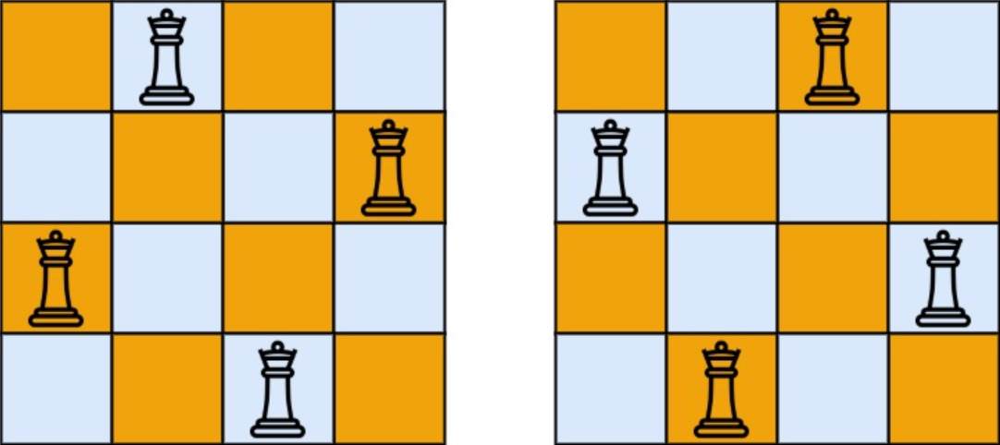

题目链接：[51-N皇后](https://leetcode-cn.com/problems/n-queens/)

难度：<font color="Red">困难</font>

题目内容：

n 皇后问题 研究的是如何将 n 个皇后放置在 n×n 的棋盘上，并且使皇后彼此之间不能相互攻击。<br>
给你一个整数 n ，返回所有不同的 n 皇后问题 的解决方案。<br>
每一种解法包含一个不同的 n 皇后问题 的棋子放置方案，该方案中 'Q' 和 '.' 分别代表了皇后和空位。

示例 1：<br>
<br>
输入：n = 4<br>
输出：\[[".Q..","...Q","Q...","..Q."],["..Q.","Q...","...Q",".Q.."]]<br>
解释：如上图所示，4 皇后问题存在两个不同的解法。

示例 2：<br>
输入：n = 1<br>
输出：\[["Q"]]

提示：<br>
1 <= n <= 9


代码：
```
class Solution {
public:
    bool check(vector<string> &temp, int n, int row, int col) {
        for (int i = 0; i < row; ++i) {
            if (temp[i][col] == 'Q')
                return false;
        }
        for (int k = 1; k <= min(row, col); ++k) {
            if (temp[row - k][col - k] == 'Q')
                return false;
        }
        for (int k = 1; k <= min(row, n - col - 1); ++k) {
            if (temp[row - k][col + k] == 'Q')
                return false;
        }
        return true;
    }

    void dfs(vector<vector<string>>& ans, vector<string>& path, int n, int row) {
        if (row == n) {
            ans.push_back(path);
            return ;
        }
        for (int i = 0; i < n; ++i) {
            if (check(path, n, row, i)) {
                path[row][i] = 'Q';
                dfs(ans, path, n, row + 1);
                path[row][i] = '.';
            }
        }
    }

    vector<vector<string>> solveNQueens(int n) {
        vector<vector<string>> ans;
        vector<string> path(n, string(n, '.'));
        dfs(ans, path, n, 0);
        return ans;
    }
};
```