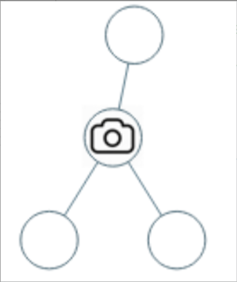
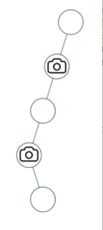

题目链接：[968-监控二叉树](https://leetcode-cn.com/problems/binary-tree-cameras/)

难度：<font color="Red">困难</font>

题目内容：

给定一个二叉树，我们在树的节点上安装摄像头。<br>
节点上的每个摄影头都可以监视其父对象、自身及其直接子对象。<br>
计算监控树的所有节点所需的最小摄像头数量。

示例 1：<br>
<br>
输入：[0,0,null,0,0]<br>
输出：1<br>
解释：如图所示，一台摄像头足以监控所有节点。

示例 2：<br>
<br>
输入：[0,0,null,0,null,0,null,null,0]<br>
输出：2<br>
解释：需要至少两个摄像头来监视树的所有节点。 上图显示了摄像头放置的有效位置之一。

提示：<br>
给定树的节点数的范围是 [1, 1000]。<br>
每个节点的值都是 0。


代码：
```
// 本题有些难理解
// 首先：摄像头是不能放在叶子结点的，因为叶子节点没有左右孩子，这样会浪费摄像头的范围
// 接下来是整棵树节点的状态标记，有以下三种情况：
// 0：该节点无覆盖
// 1：本节点有摄像头
// 2：本节点有覆盖
// 因此我们后序遍历，逐个标记节点的状态，易得，树中状态为1的节点个数就是摄像机的个数
// 需要注意，如果根节点状态为0，需要额外加一个摄像机，因为根节点没有父节点来覆盖它了
/**
 * Definition for a binary tree node.
 * struct TreeNode {
 *     int val;
 *     TreeNode *left;
 *     TreeNode *right;
 *     TreeNode() : val(0), left(nullptr), right(nullptr) {}
 *     TreeNode(int x) : val(x), left(nullptr), right(nullptr) {}
 *     TreeNode(int x, TreeNode *left, TreeNode *right) : val(x), left(left), right(right) {}
 * };
 */

class Solution {
public:
    int mark(TreeNode* root, int& ans) {
        if (!root)
            return 2;
        int left = mark(root->left, ans);
        int right = mark(root->right, ans);
        if (left == 0 || right == 0) {
            ++ans;
            return 1;
        }
        if (left == 1 || right == 1)
            return 2;
        return 0;
    }

    int minCameraCover(TreeNode* root) {
        int ans = 0;
        int temp = mark(root, ans);
        return ans + (temp ? 0 : 1);
    }
};
```